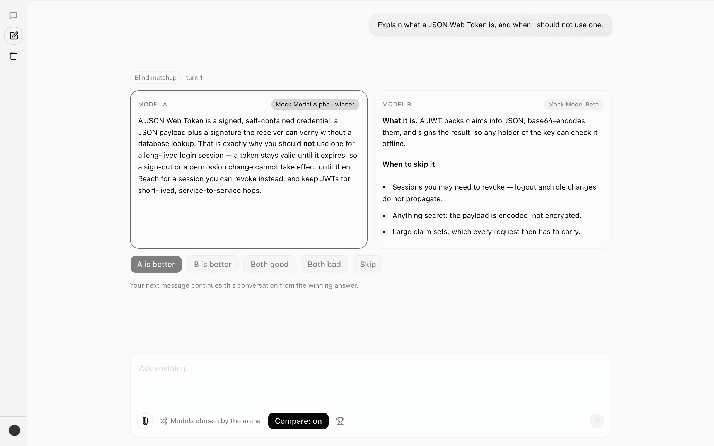
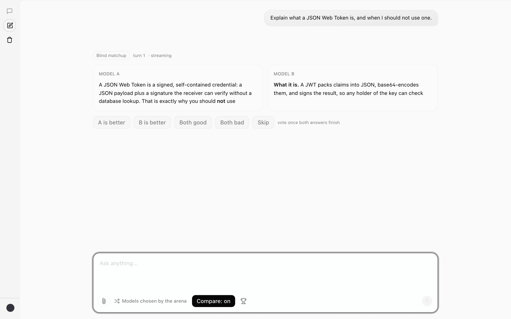

# OmniArena

[](https://github.com/M-Ali-ML/Omni-Arena/actions/workflows/ci.yml)
[](LICENSE)

OmniArena is a small, self-hosted service for blind side-by-side LLM
comparisons. It streams two anonymous answers over one connection, records
a vote, continues multi-turn chats from the winning response, and ranks models
with a statistically principled Bradley-Terry rating engine.

The stream is exposed through pluggable protocol adapters — native SSE, AG-UI,
A2UI, the Vercel AI SDK, and OpenAI-compatible SSE — and a headless React SDK
(`@omni-arena/react`) makes embedding the arena a few lines of code.



*The arena running inside the real [`vercel/ai-chatbot`](https://github.com/vercel/ai-chatbot)
template — see [`integrations/vercel-ai-chatbot/`](integrations/vercel-ai-chatbot/).*

## Run it (Docker, one command)

OmniArena ships as a single self-hosted container that bundles the API and the
web UI (single-tenant per deployment; chat data never leaves your infra). With
Docker you get Postgres, the rating worker, and the app with one command.

Requirements: Docker (Compose v2).

```bash
cp .env.example .env
# Add your Google AI Studio API key (GOOGLE_API_KEY) and a MATCHUP_TOKEN_SECRET
docker compose up
```

That builds the image, waits for Postgres, runs migrations, seeds the model
lineup, and starts the app. Open [http://localhost:3001](http://localhost:3001)
— the web UI and the `/api/...` routes are served from the same port.

The default seed enables three Gemini models, so set `GOOGLE_API_KEY` before
starting. OpenAI-compatible, Ollama, vLLM, and host-proxy providers are also
available; edit `server/src/db/seed.ts` to use them and re-run the seed.

## Run it (npm, for development)

For hot-reloading development, run Postgres + the worker in Docker and the
Node/Vite dev servers on the host.

Requirements: Node.js 20+, npm, and Docker. (Python 3.10+ on the host is only
needed to run the rating worker outside Docker.)

```bash
cp .env.example .env
# Add your Google AI Studio API key to .env
npm install
docker compose up -d postgres worker   # Postgres + the Bradley-Terry rating worker
npm run db:migrate --workspace server
npm run db:seed --workspace server
npm run dev
```

Open [http://localhost:5173](http://localhost:5173). The API listens on
`http://localhost:3001` and Vite proxies `/api` to it.

## Ratings

A separate Python worker (`worker/`) periodically fits Bradley-Terry ratings
with Fisher-information confidence intervals from the recorded votes and writes
them to the `model_ratings` table, appending a snapshot of each fit to
`model_rating_history` for the rating-over-time chart. `docker compose up -d`
starts it automatically; ratings appear on the leaderboard after the first refit
(until then the leaderboard falls back to win rate).

Bradley-Terry is a **pairwise** model, so the engine only has something to fit
when rounds are matchups that got voted on. Non-votable `single` rounds persist
no matchup and produce nothing rateable, so a deployment serving mostly those
gets no ratings at all — see [what the engine cannot
rate](docs/md/rating-methodology.md#what-the-engine-cannot-rate). For the full
statistical story see the
[rating methodology](docs/md/rating-methodology.md); to run or test the
worker directly, see [`worker/README.md`](worker/README.md) and
[`docs/md/setup.md`](docs/md/setup.md).

## Demo data

The insights dashboard is computed entirely from recorded votes, so a fresh
install shows empty charts. To fill it with synthetic history:

```bash
npm run db:seed:demo --workspace server
```

See [`docs/md/setup.md`](docs/md/setup.md#demo-data) for the flags and what the
generated data models.

## Commands

```bash
npm test       # Vitest suites across the workspaces (server, SDK, web)
npm run build  # server, SDK, and web production builds
npm run typecheck
npm run e2e    # Playwright end-to-end suite (mock provider, no API keys)
cd worker && python -m pytest   # rating worker tests (pure Python, no database)
```

Every one of these runs on each pull request and on every push to `main` — see
[`.github/workflows/ci.yml`](.github/workflows/ci.yml).

## API

- `POST /api/arena/chat` starts a matchup and streams both responses over one
  connection. The wire format is chosen with a `?protocol=` query param (or the
  `Accept` header), defaulting to native SSE; AG-UI, A2UI, Vercel AI SDK, and
  OpenAI SSE are also available. See the
  [integration guide](docs/md/integration.md) for a per-protocol walkthrough.
  A request may instead carry a `joinKey`, which pairs two sibling requests into
  one matchup — one slot per connection, one vote — for compare views that fan a
  multi-model turn out into a request per model. See
  [`docs/md/api.md`](docs/md/api.md#serving-one-matchup-over-two-requests-joinkey).
- `POST /chat/completions` (and `/v1/chat/completions`) is the same handler
  behind an OpenAI-compatible surface — the path selects the protocol, and
  `GET /models` (and `/v1/models`) publishes the enabled roster that OpenAI
  clients use as their connection check and model picker. A stock client reads
  `choices[0]` and so sees slot A as one ordinary answer; slot B rides
  `choices[1]` and the arena's ids ride an `omni_arena` extension, so blind
  side-by-side voting needs a client that reads them.
- `POST /api/arena/vote` records one vote and reveals model identities.
- `GET /api/arena/leaderboard` returns win/loss/tie counts and win rates, plus
  Bradley-Terry `rating`, `confidenceInterval`, and `componentId` fields (null
  until the rating worker has run).
- `GET /api/arena/control` is a WebSocket control plane for stopping an
  in-flight matchup (mid-stream steering is a documented stub for now).
- `GET /api/arena/analytics/*` serves read-only aggregates behind the demo's
  `/insights` dashboard: summary, head-to-head records, per-model latency and
  style metrics, vote activity, style-control coefficients, and rating history.
  See [`docs/md/api.md`](docs/md/api.md).

## Embedding

The arena hooks are packaged as a headless React library,
[`@omni-arena/react`](packages/react-sdk) (`useArenaChat`, `useArenaVote`,
`useArenaLeaderboard`, plus one hook per analytics endpoint). The same package
also exports the React-free primitives those hooks are built from — session id,
SSE decoding, event parsing, and vote submission — so a non-React or
server-side client can reuse the protocol without the hooks. The demo `web/`
app is the reference consumer; see
[`docs/md/sdk.md`](docs/md/sdk.md) for the API and a copy-paste integration. To
embed the arena into an existing chat stack over one of the wire protocols
instead, see the [integration guide](docs/md/integration.md).

## Examples

Two runnable reference integrations live in [`examples/`](examples/):

- [`examples/vercel-ai-chatbot/`](examples/vercel-ai-chatbot/) — a Next.js 16 +
  Vercel AI SDK app driving arena mode through the `?protocol=vercel-ai` adapter.
- [`examples/assistant-ui/`](examples/assistant-ui/) — a Vite + React app running
  arena mode through assistant-ui's AI SDK runtime.

Both run key-free against the deterministic mock provider and are exercised by
the end-to-end suite (`npm run e2e`). See
[`docs/md/setup.md`](docs/md/setup.md#reference-examples).

For arena mode inside a real third-party app rather than a purpose-built
scaffold, [`integrations/vercel-ai-chatbot/`](integrations/vercel-ai-chatbot/)
clones the actual [`vercel/ai-chatbot`](https://github.com/vercel/ai-chatbot)
template at a pinned commit and layers the arena on top of it, with its own
credential-free Playwright suite.



Both answers stream over one connection inside the template's own message list;
[more screenshots](integrations/vercel-ai-chatbot/README.md#what-it-looks-like)
cover the vote, the reveal, multi-turn continuation, and the leaderboard.

Two more upstream apps get the same treatment, each pinned to an exact upstream
version and self-contained in its own directory:
[`integrations/assistant-ui/`](integrations/assistant-ui/) overlays the arena
onto the real assistant-ui monorepo over the AG-UI adapter, and
[`integrations/open-webui/`](integrations/open-webui/) drives the upstream Open
WebUI container over the OpenAI-compatible adapter — the compare view that
motivated `joinKey`. None of the three is an npm workspace; each installs and
runs through its own scripts.

## Contributing

Issues and pull requests are welcome. [`CONTRIBUTING.md`](CONTRIBUTING.md) covers
the dev setup, how to run each test suite, the repository layout, and the code
conventions the project holds to.

## Documentation

Browse the visual docs on GitHub Pages:
[https://m-ali-ml.github.io/Omni-Arena/](https://m-ali-ml.github.io/Omni-Arena/).

Source lives in [`docs/md/`](docs/md/) (Markdown) with condensed counterparts in
[`docs/html/`](docs/html/):
[architecture](docs/md/architecture.md) · [API](docs/md/api.md) ·
[integration](docs/md/integration.md) ·
[rating methodology](docs/md/rating-methodology.md) ·
[data model](docs/md/data-model.md) · [setup](docs/md/setup.md) ·
[SDK](docs/md/sdk.md).