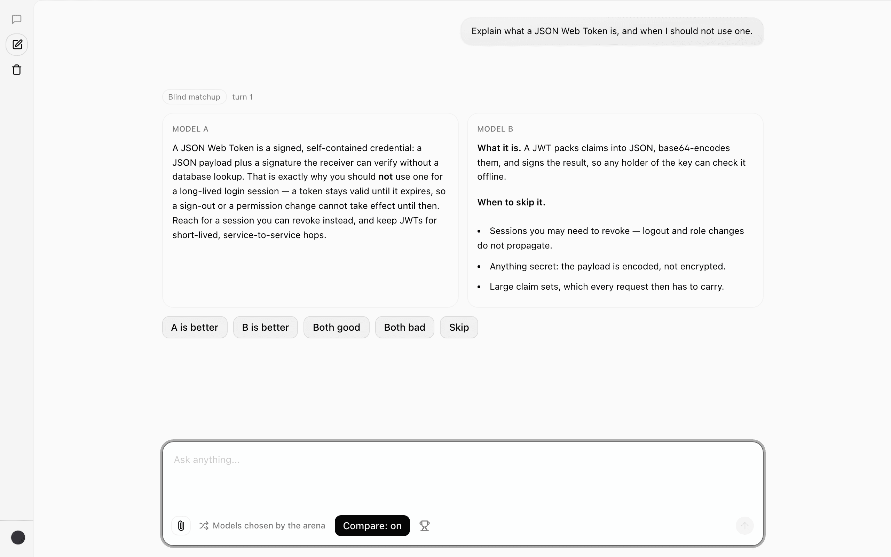
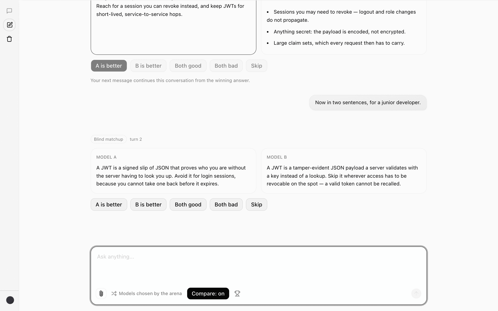
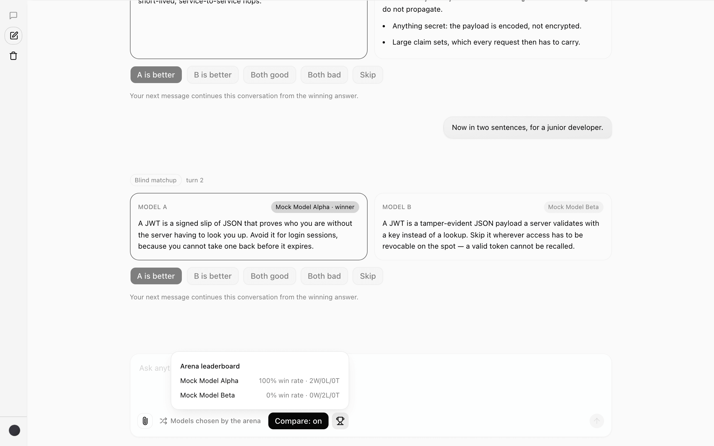
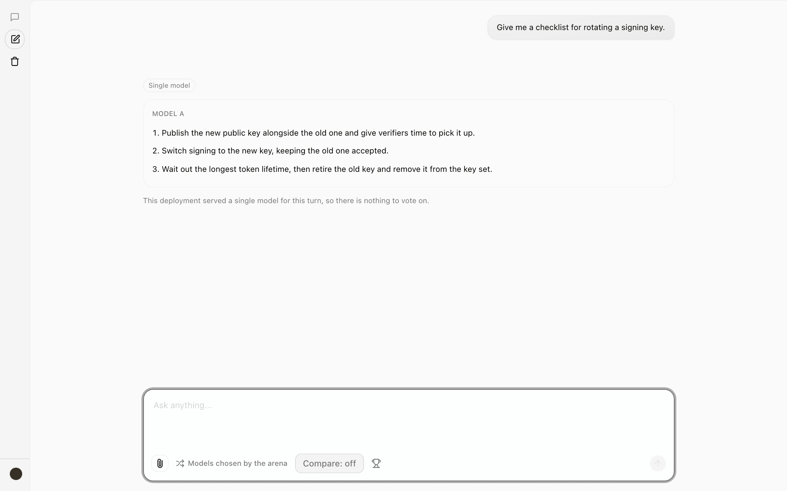
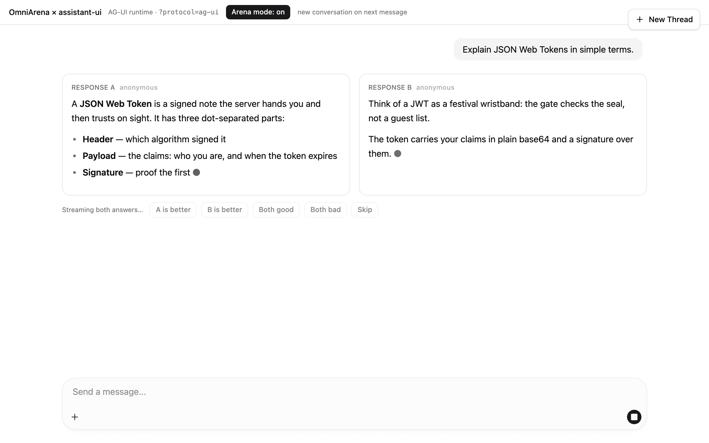
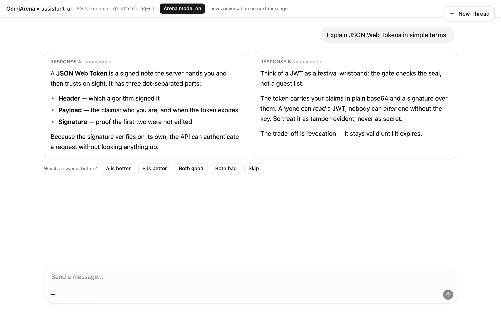
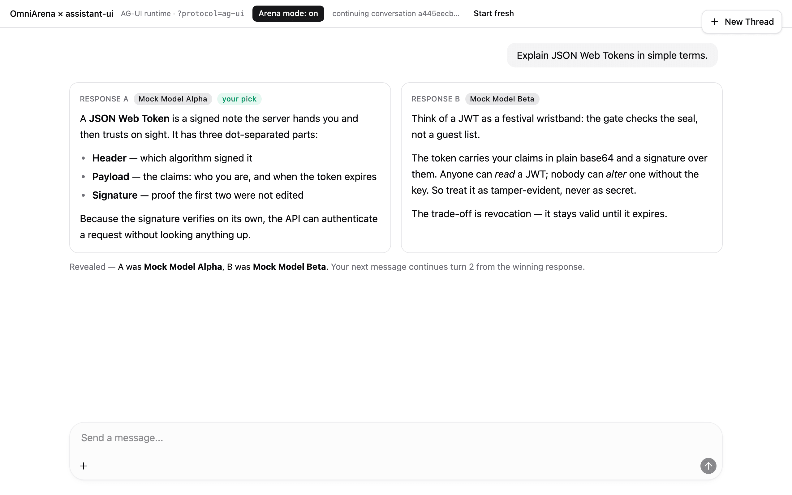
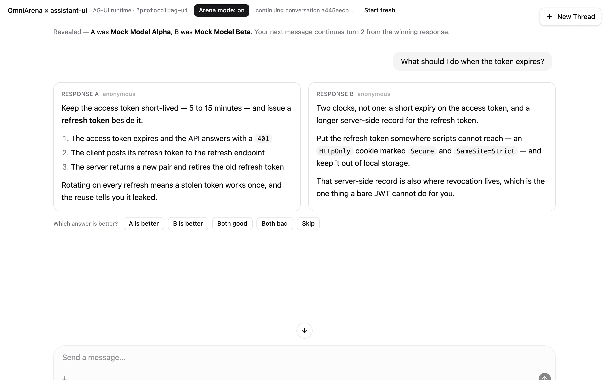
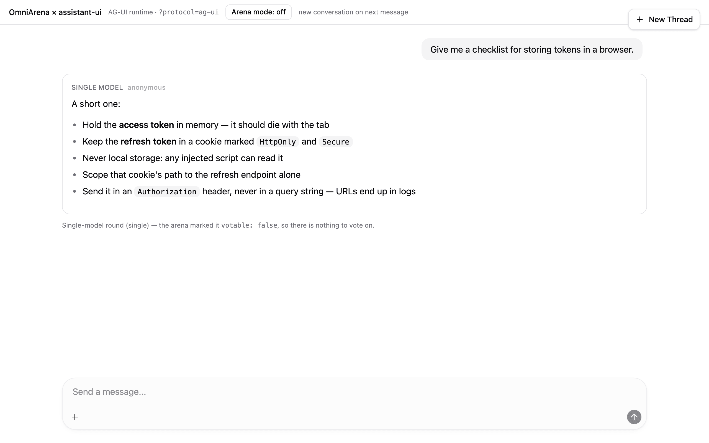

# Integration guide

OmniArena streams one blind matchup — two anonymous models, one connection — and
frames that single internal event stream in **five wire protocols** through a
pluggable adapter layer (`server/src/adapters/`). Three of the five also parse
their protocol's own request body, so a stock client of AG-UI, OpenAI, or the
Vercel AI SDK can call the arena with no translation layer at all. This guide
covers each protocol: what request body it accepts, what it emits on the wire, how
a client selects it, how Model A and Model B are carried, how to obtain the
matchup token and cast a vote, and which frontends and stacks it suits. It also
covers [slot join](#slot-join-one-matchup-over-two-requests), the one shape that
is *not* one connection: a client with a compare view that fans a turn out into
one request per model.

Related: [API](api.md) · [Architecture](architecture.md) · [SDK](sdk.md) · [Rating methodology](rating-methodology.md) · [Setup](setup.md)

## One stream, five framings

Every protocol carries the **same** internal event sequence over the same two
slots (A, B):

```
matchup_started → token* → slot_error? → slot_done → matchup_done
                                                   ↘ run_error   (terminal)
```

Only the framing differs. Each adapter validates every frame against the zod
`publicArenaEventSchema` (`server/src/core/events.ts`) before writing it, so a
malformed chunk fails loudly instead of reaching a client. Native SSE is the
default and is preserved **byte-for-byte**, so existing clients (the demo and the
`@omni-arena/react` SDK) are unaffected by the other adapters.

### Which protocols accept their own request body

Three of the five adapters are **bidirectional**: they parse their own protocol's
canonical request envelope, so a stock client of that protocol posts an
unmodified native body and needs **no translating transport** in front of the
arena.

| Protocol | Native request body accepted | Arena inputs (`sessionId`, `conversationId`, `arena`, `joinKey`) ride in |
|---|---|---|
| AG-UI | `RunAgentInput` — what `new HttpAgent({ url })`, `useAGUIRuntime({ url })`, CopilotKit and LangGraph all post | `forwardedProps` |
| OpenAI-compatible | a standard `/chat/completions` body (`{ model, messages, stream, … }`) | the `omni_arena` request extension; `user` also seeds `sessionId` |
| Vercel AI SDK | the body `useChat` posts (AI SDK v5 `parts`, or v4 `content`) | top level, i.e. `useChat({ body: { sessionId } })` |
| Native SSE | — (its native body *is* OmniArena's) | top level |
| A2UI | — no canonical client request envelope exists to be compatible with | top level |

Every protocol reads the same four arena fields out of its own extension slot
(one `arenaPropsSchema` in `server/src/adapters/request-adapter.ts`), so
[slot join](#slot-join-one-matchup-over-two-requests) is available on all five
paths, not only the native one.

**OmniArena's own body still works everywhere, on every protocol.** The two
shapes are told apart structurally: a body carrying a **`messages` array and no
`prompt`** is that protocol's envelope; anything else is OmniArena's
`{ prompt, sessionId?, conversationId?, arena?, joinKey? }`, unchanged. A body with both
stays on the OmniArena path, so a transport that already sends `prompt` alongside
a transcript keeps its exact previous meaning. The `x-arena: on` header works on
every path either way (see [Setup → trigger modes](setup.md#trigger-modes)).

Three things are worth knowing before you point a stock client at the arena:

- **Only the newest user message becomes the prompt.** Earlier messages are the
  client's own transcript and are ignored: on a multi-turn round the arena
  rebuilds history from the *winning* responses it persisted (which requires a
  decisive vote), so trusting a client-supplied transcript would let the caller
  choose which of the two blind answers becomes the shared context. Multi-turn
  therefore still means "pass `conversationId` back", per protocol as above.
- **Fields the arena cannot honour are ignored, not rejected.** An OpenAI
  `temperature` or `max_tokens`, an AG-UI `tools`/`state`/`context`, a `useChat`
  `trigger` — all accepted and dropped, because the arena picks the models and
  the sampling. Non-text message parts (images, tool calls) contribute their text
  and nothing else.
- **Validation stays strict on what is read.** Every field the arena consumes is
  zod-validated at the boundary (`server/src/adapters/request-adapter.ts` plus
  each adapter's own envelope schema); a malformed `conversationId`, an envelope
  with no user message to answer, or `stream: false` on the OpenAI path fails
  loudly with a field-named error rather than being silently defaulted.

The arena-native paths are unaffected: the native SSE stream and the
`@omni-arena/react` SDK speak OmniArena's request shape by construction.

### Selecting a protocol

The chat route (`POST /api/arena/chat`) resolves both halves of a protocol —
response framing and request parsing — from one decision
(`server/src/adapters/registry.ts` → `selectProtocol`), so the client that asks
for AG-UI framing is also the one allowed to post an AG-UI body. The precedence
is:

1. `?protocol=` query parameter (case-insensitive alias).
2. The request `Accept` header media type.
3. Default: **native SSE**.

An unknown `?protocol=` value falls back to native SSE, so a bad value never
breaks the default path.

| Protocol | `?protocol=` aliases | `Accept` media type(s) | Response `content-type` | Native request body |
|---|---|---|---|---|
| Native SSE *(default)* | `sse`, `native`, `native-sse` | `text/event-stream` | `text/event-stream` | OmniArena's own |
| AG-UI | `agui`, `ag-ui` | `application/vnd.ag-ui+json` | `text/event-stream` | `RunAgentInput` |
| A2UI | `a2ui` | `application/vnd.a2ui+json`, `application/x-ndjson` | `application/x-ndjson` | — |
| Vercel AI SDK | `vercel`, `vercel-ai`, `ai-sdk` | `application/vnd.vercel.ai.ui-message-stream+json` | `text/event-stream` (+ `x-vercel-ai-ui-message-stream: v1`) | `useChat` body |
| OpenAI SSE | `openai`, `openai-sse` | `application/vnd.openai.chat-chunk+json` | `text/event-stream` | `/chat/completions` |

The arena is also served at **`POST /chat/completions`** and
**`POST /v1/chat/completions`**, where the OpenAI protocol is implied by the path
— an OpenAI client is configured with a base URL and appends the path itself, so
it can never send `?protocol=openai`. Those paths behave exactly like
`/api/arena/chat?protocol=openai`.

## Model A vs Model B, and the vote flow

Both models are **anonymous** while streaming. Each protocol tags its two slots
so a client can render them in two columns; identities are only revealed after a
vote. How the two slots are carried differs per protocol (see each section
below), but the voting flow is always the same three steps:

1. **Obtain the matchup token.** `POST /api/arena/vote` needs the `matchupId`
   and the signed `matchupToken` minted when the round started. Where that token
   appears on the wire depends on the protocol.
2. **Let the user pick a winner** once both slots finish: `left`, `right`,
   `both_good`, `both_bad`, or `skip`.
3. **`POST /api/arena/vote`** with `{ matchupId, matchupToken, vote }`. On
   success it returns `{ accepted: true, models: { A, B } }` — the reveal. See
   [API → vote](api.md).

> **Every protocol carries the vote token** when there is one, each in its own
> idiom, so no path needs a second channel to vote: native SSE on
> `matchup_started`, Vercel AI SDK in the `data-arena-meta` part, A2UI on
> `surface_init`, AG-UI in a `CUSTOM` event named `arena_matchup`, and OpenAI SSE
> in an optional `omni_arena` extension object on the first chunk. All five also
> carry `mode` and `votable`, so a client can hide the vote controls on a
> non-votable (`single`) round. `mode` is `matchup` or `single` in practice;
> `shadow` is declared in the shared event schema so consumers can be exhaustive,
> but no request currently resolves to it.

### Identifiers you cannot use are not sent

A `single` round persists no matchup: there is no token to vote with, no
conversation to continue, and no turn to number. All five protocols therefore
**omit** `matchupToken`, `conversationId`, and `turnIndex` on such a round rather
than emitting an empty string or a freshly minted id nothing can resolve — the
old behaviour, which handed clients a `conversationId` that answered
`404 Conversation not found` on the next turn. Absence is the signal; `votable:
false` says the same thing positively. A client that stored the previous
behaviour's `matchupToken: ""` sentinel should treat empty and absent alike.

Because such a round records no comparison, it also contributes nothing to the
ratings: Bradley-Terry fits pairwise data only, so a `single` round is not a
weaker rating signal but no rating signal at all. See [rating methodology → what
the engine cannot
rate](rating-methodology.md#what-the-engine-cannot-rate).

## Slot join: one matchup over two requests

Everything above assumes the arena's default shape — both slots interleaved on
**one** connection. A real chat UI with a compare view does not send that shape.
It fans a multi-model turn out into **one request per model**, each carrying a
single answer channel and sharing a conversation identifier; Open WebUI v0.10 is
the measured case (`integrations/open-webui/`, which had to pair the two
requests inside a bridge). Served naively, such a client either garbles both
answers into one column or produces two unrelated matchups and two half-votes.

**Slot join** fixes that server-side. A request that opts in with a `joinKey`
becomes half of a matchup: the first arrival — the **leader** — claims slot A, a
sibling that arrives within a short window claims slot B, each streams its own
slot over its own connection, and there is **one** matchup row, one generation
per model, and one vote. Matchmaking, blindness, the conversation, and
persistence all happen exactly once, on the leader's path
(`server/src/arena/join.ts`, `server/src/routes/chat.ts`).

```
POST /api/arena/chat  { prompt, sessionId, joinKey: "chat-7f3a" }   → slots: ["A"]
POST /api/arena/chat  { prompt, sessionId, joinKey: "chat-7f3a" }   → slots: ["B"]
                       ↳ same matchupId, same matchupToken, same conversationId
```

Both connections' `matchup_started` carry the **same** `matchupId`,
`matchupToken`, `conversationId`, and `turnIndex`, with `mode: "matchup"` and
`votable: true`; each announces only its own slot, so a client renders one
column per response and either connection can cast the single vote.

- **Opting in.** `joinKey` is a client-supplied correlation id it already has —
  Open WebUI's `chat_id` will do. It rides the same extension slot as
  `sessionId`, so it works on every protocol, including a stock OpenAI body's
  `omni_arena` object.
- **`sessionId` is required.** A join is authorised by its whole *scope* — the
  anonymous session, the turn's conversation, and the exact prompt, HMAC'd with
  a per-process secret — not by the `joinKey` alone, which is only a
  correlation id. A `joinKey` without a `sessionId` is refused
  (`400 join_requires_session`) rather than silently downgraded to a
  client-chosen string any third party could guess and attach to. A sibling that
  differs in session, conversation, or prompt lands in a different scope and
  simply gets its own matchup.
- **Unpaired degrades to today's shape.** If the window closes with no sibling,
  the round runs both slots on that one connection (`slots: ["A", "B"]`,
  votable) — nothing is generated in vain and the vote stays honest, because the
  user sees both answers either way.
- **A slow client cannot lose slot B.** The leader owns the shared generation and
  all persistence, so slot B finishes and is recorded even if its sibling
  disconnects. The sibling gets its own control-plane handle, so stopping *its*
  stream does not stop the shared round.
- **A failure hits both halves identically.** A pre-stream error on the leader's
  path (`404 Conversation not found`, a write conflict) is forwarded to the
  sibling, so it reports the same thing instead of hanging.

| Situation | Response |
|---|---|
| `joinKey` with no `sessionId` | `400` `join_requires_session` |
| A third request on a scope whose two slots are taken | `409` `join_slots_exhausted` |
| A sibling arriving after the window closed | `409` `join_expired` |
| Too many unpaired scopes in flight | `503` `join_unavailable` |
| The leader never started the round | `504` `join_leader_timeout` |

These are HTTP statuses on every protocol except AG-UI, whose clients read a
non-2xx as a dead transport and therefore receive them in-band as a `200` stream
carrying `RUN_ERROR` (see [AG-UI](#ag-ui) below).

Two environment variables tune the rendezvous: `ARENA_JOIN_WINDOW_MS` (the
window, default `2000`; **`0` disables joining entirely** and a `joinKey` is then
ignored, so every request gets its own two-slot round) and
`ARENA_JOIN_MAX_PENDING` (unpaired scopes held in memory, default `256`). A third,
`ARENA_JOIN_MAX_QUEUED_EVENTS` (default `4096`), caps the per-connection event
backlog once a round is joined. Joining is opt-in per request, so a client that
never sends a `joinKey` is unaffected by any of them. See [API → chat](api.md)
for the field-by-field request contract and [Setup](setup.md) for all three.

---

## Native SSE (default)

**Select:** nothing (default), or `?protocol=sse`, or `Accept: text/event-stream`.
**Adapter:** `server/src/adapters/sse.ts`.

Each internal event becomes one `event:`/`data:` pair. There is no trailing
sentinel. This is the canonical shape documented in the [API](api.md).

```
event: matchup_started
data: {"type":"matchup_started","matchupId":"m1","matchupToken":"eyJ….sig","conversationId":"c1","turnIndex":0,"slots":["A","B"]}

event: token
data: {"type":"token","slot":"A","token":"He"}

event: token
data: {"type":"token","slot":"B","token":"Yo"}

event: slot_done
data: {"type":"slot_done","slot":"A"}

event: matchup_done
data: {"type":"matchup_done"}
```

- **Model A vs B:** every `token`, `slot_error`, and `slot_done` event carries a
  `slot` field (`"A"` or `"B"`); route on it.
- **Vote token:** the `matchup_started` event carries `matchupId` **and**
  `matchupToken` directly — this path is self-contained and votable.
- **Failures:** a single dead slot is `slot_error`; a round that dies outright is
  a terminal `event: run_error` with `{ code, message }` and no `matchup_done`.
  Pre-stream failures stay HTTP status codes on this path (see [API](api.md)).
- **Suits:** the OmniArena demo, the [`@omni-arena/react`](sdk.md) SDK, and any
  custom `EventSource`/`fetch`-reader client. The simplest option and the one to
  use when you control both ends.

---

## AG-UI

**Select:** `?protocol=ag-ui` (alias `agui`) or `Accept: application/vnd.ag-ui+json`.
**Adapter:** `server/src/adapters/ag-ui.ts`. **Transport:** SSE (one `data:`
line per typed AG-UI event).

The two arena slots become two concurrent AG-UI text messages inside one run.
The adapter emits the subset of the [AG-UI](https://ag-ui.com) event taxonomy the
arena needs: run lifecycle, text streaming, and `CUSTOM` events for the two
payloads outside that taxonomy — the matchup metadata and a single-slot error.

```
data: {"type":"RUN_STARTED","threadId":"c1","runId":"m1"}

data: {"type":"CUSTOM","name":"arena_matchup","value":{"matchupId":"m1","matchupToken":"eyJ….sig","slots":["A","B"],"mode":"matchup","votable":true,"conversationId":"c1","turnIndex":0}}

data: {"type":"TEXT_MESSAGE_START","messageId":"m1:A","role":"assistant","slot":"A"}

data: {"type":"TEXT_MESSAGE_START","messageId":"m1:B","role":"assistant","slot":"B"}

data: {"type":"TEXT_MESSAGE_CONTENT","messageId":"m1:A","delta":"He","slot":"A"}

data: {"type":"TEXT_MESSAGE_CONTENT","messageId":"m1:B","delta":"Yo","slot":"B"}

data: {"type":"CUSTOM","name":"slot_error","value":{"slot":"B","message":"boom"}}

data: {"type":"TEXT_MESSAGE_CONTENT","messageId":"m1:B","delta":"\n\n[omni-arena:slot-error] boom\n","slot":"B"}

data: {"type":"TEXT_MESSAGE_END","messageId":"m1:A","slot":"A"}

data: {"type":"RUN_FINISHED","threadId":"c1","runId":"m1"}
```

- **Request:** a canonical **`RunAgentInput`** is accepted, so
  `new HttpAgent({ url: "…/api/arena/chat?protocol=ag-ui" })` — and therefore
  `useAGUIRuntime({ url })`, CopilotKit's and LangGraph's AG-UI transports — is a
  working OmniArena client with no subclass in between. The prompt is the newest
  `user` message; `forwardedProps` carries `sessionId`, `conversationId`, and the
  `arena` opt-in; `state`, `tools`, and `context` are ignored. `threadId` is
  deliberately **not** read as a `conversationId`: clients mint their own thread
  ids (assistant-ui mints a UUID), so doing so would answer every stock client's
  first turn with `404 Conversation not found`. OmniArena's own body is still
  accepted here too.
- **Event mapping:** `matchup_started` → `RUN_STARTED` + `CUSTOM`
  `arena_matchup` + one `TEXT_MESSAGE_START` per slot; `token` →
  `TEXT_MESSAGE_CONTENT` (`delta`, `slot`); `slot_error` → `CUSTOM` named
  `slot_error` **plus** a marked `TEXT_MESSAGE_CONTENT` (below), so the surviving
  slot keeps streaming; `slot_done` → `TEXT_MESSAGE_END`; `run_error` →
  `RUN_ERROR`; `matchup_done` → `RUN_FINISHED`.
- **Model A vs B:** each message is tagged `slot` (`"A"`/`"B"`) and has a stable
  `messageId` of `"<runId>:<slot>"`; `runId` is the matchup id and `threadId`
  the conversation id — or, on a round with no conversation, the matchup id
  again, since AG-UI requires a thread on every run.
- **A dead slot is visible:** mainstream runtimes drop `CUSTOM` events
  (assistant-ui's aggregator has no case for one), which left a failed slot as a
  permanently blank column. The message therefore also receives the failure as
  text, prefixed `[omni-arena:slot-error]` so it is distinguishable from the
  model having said those words. The `CUSTOM` event remains the authoritative,
  structured form.
- **Failures are in-band:** an AG-UI client settles a run on `RUN_ERROR` and
  treats a non-2xx response as a dead transport, so on this protocol *every*
  arena failure — including the `409` "vote before continuing" — arrives as a
  `200` stream whose event is `RUN_ERROR` with a `message` and a machine-readable
  `code`. A mid-stream failure does the same rather than ending the response with
  neither `RUN_FINISHED` nor an error, which used to hang clients outright.
- **Vote token:** the `CUSTOM` event named `arena_matchup`, emitted right after
  `RUN_STARTED`, carries `matchupId` **and** `matchupToken` (plus `slots`,
  `mode`, `votable`, `conversationId`, `turnIndex`) — so the AG-UI path is
  **votable** without a second channel. AG-UI's typed taxonomy has no token
  field, and `CUSTOM` is its sanctioned escape hatch for exactly this; a client
  that ignores `CUSTOM` events still renders the stream correctly. Because
  mainstream runtimes *do* ignore it, the same metadata is repeated in the
  `x-arena-matchup` response header and readable back from
  [`GET /api/arena/matchups/:id`](api.md#get-apiarenamatchupsmatchupid) — the
  header is the one a fetch wrapper or proxy can reach without the runtime's
  cooperation.
- **Run ids are echoed:** a `RunAgentInput` carrying `threadId`/`runId` gets
  them back on `RUN_STARTED` and `RUN_FINISHED`. The slot channel does not move
  with them — `messageId` is always `<matchupId>:<slot>`.
- **Suits:** frontends built on the AG-UI event taxonomy — CopilotKit, LangGraph,
  CrewAI, assistant-ui's first-party
  [`@assistant-ui/react-ag-ui`](https://github.com/assistant-ui/assistant-ui)
  runtime — **in both directions**: they can post to the arena directly, and the
  response drops into such a runtime unchanged, two concurrent messages included.
  One caveat survives: mainstream runtimes discard `CUSTOM` events, so a client
  that wants to *vote* reads the metadata from the `x-arena-matchup` header (or
  `GET /api/arena/matchups/:id`) rather than through the runtime's message
  state — an `AgentSubscriber` on the raw event stream also works and is what
  the shipped integration did before the header existed. [`integrations/assistant-ui/`](../../integrations/assistant-ui/)
  runs against the real `@assistant-ui/react-ag-ui` runtime and now votes via the
  header; its remaining custom agent only injects `forwardedProps` / `x-arena`
  that `useAgUiRuntime` cannot set. The [`examples/assistant-ui/`](../../examples/assistant-ui/) app runs on
  assistant-ui too, via the AI SDK runtime.

---

## A2UI

**Select:** `?protocol=a2ui` or `Accept: application/vnd.a2ui+json` /
`application/x-ndjson`.
**Adapter:** `server/src/adapters/a2ui.ts`. **Transport:** **NDJSON**
(`application/x-ndjson`) — one flat, self-describing JSON object per line.

Each line is a versioned (`a2ui/1`) message that paints one of two side-by-side
**surfaces** (one per slot), so a generative-UI frontend can render each side
with its own local design system.

```
{"v":"a2ui/1","kind":"surface_init","matchupId":"m1","matchupToken":"eyJ….sig","conversationId":"c1","turnIndex":0,"surfaces":["A","B"],"mode":"matchup","votable":true}
{"v":"a2ui/1","kind":"text_append","surface":"A","text":"He"}
{"v":"a2ui/1","kind":"text_append","surface":"B","text":"Yo"}
{"v":"a2ui/1","kind":"error","surface":"B","message":"boom"}
{"v":"a2ui/1","kind":"surface_done","surface":"A"}
{"v":"a2ui/1","kind":"session_done"}
```

- **Event mapping:** `matchup_started` → `surface_init`; `token` →
  `text_append`; `slot_error` → `error`; `slot_done` → `surface_done`;
  `run_error` → `session_error` (`{ code, message }`, terminal);
  `matchup_done` → `session_done`.
- **Model A vs B:** every message names its `surface` (`"A"`/`"B"`);
  `surface_init` lists the surfaces to create up front.
- **Vote token:** the `surface_init` message carries `matchupId` **and**
  `matchupToken` (plus `conversationId`, `turnIndex`, `mode`, and `votable`) —
  so the A2UI path is **votable** without a second channel. A2UI messages are
  flat and self-describing by design, so the token needs no envelope of its own.
- **Parsing:** split the body on `\n`; each non-empty line is a complete JSON
  object (no `data:` prefix, no SSE framing).
- **Request:** OmniArena's own body. This adapter is **output-only on ingress**:
  A2UI describes how an agent paints a UI, not how a client asks for one, so
  there is no canonical request envelope to accept — inventing one would be a
  shape no third-party client sends. If a de-facto A2UI request body emerges, it
  plugs into the same `RequestAdapter` port the other three use.
- **Suits:** generative-UI / "agent-to-UI" frontends that want a schema-first,
  design-system-agnostic stream and paint their own components per surface.

---

## Vercel AI SDK

**Select:** `?protocol=vercel-ai` (aliases `vercel`, `ai-sdk`) or
`Accept: application/vnd.vercel.ai.ui-message-stream+json`.
**Adapter:** `server/src/adapters/vercel-ai.ts`. **Transport:** the AI SDK
**UI Message Stream** over SSE, with header `x-vercel-ai-ui-message-stream: v1`
and a trailing `data: [DONE]` sentinel.

A stock [`useChat`](https://sdk.vercel.ai) client can both post to and render this
stream without modification. Slot A rides the primary text channel; slot B is
multiplexed through custom `data-*` parts so a sidecar renderer can paint it
beside the main answer.

```
data: {"type":"start"}

data: {"type":"data-arena-meta","data":{"matchupId":"m1","matchupToken":"eyJ….sig","conversationId":"c1","turnIndex":0,"mainSlot":"A","dataSlot":"B","mode":"matchup","votable":true}}

data: {"type":"text-start","id":"m1"}

data: {"type":"text-delta","id":"m1","delta":"He"}

data: {"type":"data-arena-b-delta","data":{"text":"Yo"}}

data: {"type":"text-delta","id":"m1","delta":"llo"}

data: {"type":"data-arena-error","data":{"slot":"B","message":"boom"}}

data: {"type":"data-arena-b-done","data":{}}

data: {"type":"text-end","id":"m1"}

data: {"type":"finish"}

data: [DONE]
```

- **Request:** the body `useChat` posts is accepted, in both message shapes (AI
  SDK v5 puts the text in `parts`, v4 used `content`). Arena inputs are read from
  the top level, which is where `useChat({ body })` puts extra fields, so
  `useChat({ api: "…/api/arena/chat?protocol=vercel", body: { sessionId } })`
  needs no server route of its own. `id`, `trigger`, and `messageId` are ignored.
  In a Next.js app you will usually still want a route in front — to keep the
  arena origin server-side, or because `useChat` posts to a same-origin path
  anyway — but it is now a proxy, not a translator.
- **Model A vs B:** **Model A** is the primary assistant text
  (`text-start`/`text-delta`/`text-end`); **Model B** streams through custom
  data parts (`data-arena-b-delta` with `{ text }`, then `data-arena-b-done`).
  Read A off the message's `text` parts and B off its `data-arena-b-delta`
  parts.
- **Errors:** a single-slot failure is a `data-arena-error` part
  (`{ slot, message }`) and the surviving slot keeps streaming; a round that dies
  outright is the AI SDK's own `error` part (`{ errorText }`), which `useChat`
  surfaces as the chat's error state.
- **Vote token:** the `data-arena-meta` part carries `matchupId` **and**
  `matchupToken` (plus `conversationId`, `turnIndex`, and which slot is `main`
  vs `data`) — so the AI SDK path is **votable** without a second channel.
- **Trigger mode:** `data-arena-meta` also carries `mode` and `votable`. A `single` round streams the
  main text channel only and has no usable vote token, so a client renders one
  column and hides the vote controls when `votable` is `false`.
- **Suits:** the React + Vercel AI SDK family — the
  [Vercel AI Chatbot template](https://github.com/vercel/ai-chatbot), Lobe Chat,
  and any `useChat` app. The lowest-friction path in practice: the app already
  has a server route between `useChat` and the model, and that route becomes the
  transport.
- **Runnable example:** [`examples/vercel-ai-chatbot/`](../../examples/vercel-ai-chatbot/)
  — a Next.js 16 App Router app whose server route forwards to this adapter and
  pipes the UI Message Stream straight to a stock `useChat` client.

---

## OpenAI-compatible SSE

**Select:** `?protocol=openai` (alias `openai-sse`) or
`Accept: application/vnd.openai.chat-chunk+json`.
**Adapter:** `server/src/adapters/openai-sse.ts`. **Transport:** SSE with
`chat.completion.chunk` frames and a trailing `data: [DONE]` sentinel.

The arena masquerades as a normal OpenAI streaming endpoint, request included, so
an OpenAI-compatible chat UI can drive it. Both slots ride the `choices` array of
one dual-stream completion, and **every frame lists both**, in slot order:
`choices[0]` is always slot A, `choices[1]` always slot B.

Point a client at `{base}` and it works: `POST /chat/completions` and
`POST /v1/chat/completions` serve the arena with this protocol implied by the
path, and `GET /models` / `GET /v1/models` answer the connection probe.

```
data: {"id":"chatcmpl-…","object":"chat.completion.chunk","created":1770000000,"model":"omni-arena","choices":[{"index":0,"delta":{"role":"assistant"},"finish_reason":null},{"index":1,"delta":{"role":"assistant"},"finish_reason":null}],"omni_arena":{"matchupId":"m1","matchupToken":"eyJ….sig","conversationId":"c1","turnIndex":0,"mode":"matchup","votable":true}}

data: {"id":"chatcmpl-…","object":"chat.completion.chunk","created":1770000000,"model":"omni-arena","choices":[{"index":0,"delta":{"content":"He"},"finish_reason":null},{"index":1,"delta":{},"finish_reason":null}]}

data: {"id":"chatcmpl-…","object":"chat.completion.chunk","created":1770000000,"model":"omni-arena","choices":[{"index":0,"delta":{},"finish_reason":null},{"index":1,"delta":{"content":"Yo"},"finish_reason":null}]}

data: {"id":"chatcmpl-…","object":"chat.completion.chunk","created":1770000000,"model":"omni-arena","choices":[{"index":0,"delta":{},"finish_reason":null},{"index":1,"delta":{},"finish_reason":"stop"}]}

data: [DONE]
```

- **Request:** a standard `/chat/completions` body is accepted. The prompt is the
  newest `user` message (string `content` or text parts); `user` seeds the
  anonymous `sessionId`; sampling knobs and tool declarations are ignored. There
  is no standard home for a conversation id or the arena opt-in, so those ride an
  `omni_arena` request extension — `{ sessionId?, conversationId?, arena? }`, the
  mirror of the `omni_arena` object this adapter writes onto the first chunk.
  **`stream: false` is refused** with a `400` naming the field: a matchup is two
  live streams, and there is no buffered `chat.completion` object to return.
- **Why both choices in every frame.** OpenAI's chunk schema allows several
  `choices` entries — that is how `n > 1` is expressed — and each carries an
  `index`. But no real client demultiplexes on that index: Open WebUI reads
  `choices[0].delta.content` in its SvelteKit parser and `choices[0]` in its
  Python middleware, and langchain-openai likewise takes only the first choice.
  Readers are *positional* in practice. This adapter used to emit one choice per
  frame with the slot in `index`, so a positional reader spliced both models'
  tokens into a single incoherent message — at HTTP 200, with a clean `[DONE]`,
  i.e. silently. Pinning slot A to `choices[0]` gives such a reader exactly one
  coherent answer, while a client that does honour `index` still gets slot B from
  `choices[1]` of the same frame. A slot with nothing to say in a frame gets an
  empty `delta`, and a finished slot keeps its `finish_reason: "stop"` in later
  frames rather than retracting it.
- **Model A vs B:** `role: "assistant"` on start, `content` deltas per token,
  `finish_reason: "stop"` on `slot_done`. A `single` round declares one slot, so
  its frames carry one choice. (`matchup_done` emits nothing; the `[DONE]`
  sentinel closes the stream.)
- **A dead slot is marked:** a slot failure adds a top-level `omni_arena_error`
  (`{ slot, message }`) — the structured, authoritative form — and puts the same
  text in that choice's `delta.content` behind an `[omni-arena:slot-error]`
  marker, since a plain OpenAI client has no other channel to learn the column is
  dead and would otherwise read the message as the model's own words.
- **Terminal failure:** a dead round emits what OpenAI-compatible servers already
  emit mid-stream — a frame whose payload is
  `{ "error": { message, type: "omni_arena_error", code } }` — then `[DONE]`.
- **Vote token and multi-turn:** the **first** chunk carries an optional
  top-level `omni_arena` object with `matchupId`, `matchupToken`,
  `conversationId`, `turnIndex`, `mode`, and `votable`; later chunks are plain
  OpenAI chunks. OpenAI's contract dictates the chunk shape, so arena data cannot
  become a required field — but OpenAI-compatible clients ignore unrecognized
  top-level response fields, so Open WebUI and friends keep working unchanged
  while an arena-aware client reads the token off chunk one, votes, and continues
  the conversation on the next turn.
- **Model list:** OpenAI-compatible UIs probe `GET {base}/models` on connect;
  OmniArena answers it (and `/v1/models`) with the enabled roster in OpenAI's
  list shape. See [API → GET /models](api.md).
- **Suits:** the OpenAI-compatible chat-UI "big three" — Open WebUI (the largest
  audience, SvelteKit + FastAPI), LibreChat, Lobe Chat — plus Chatbot-UI-class
  frontends and any OpenAI SDK client. Those can now **call** the arena directly.
  What "OpenAI-compatible" still does not give you is the *interaction*: OpenAI's
  protocol has no vote, no reveal, and (in most UIs) one message channel per
  turn, so rendering two columns and collecting a vote inside such an app remains
  the app's problem. [`integrations/open-webui/`](../../integrations/open-webui/)
  ships a bridge that solves exactly that for Open WebUI. Two thirds of that
  bridge have since moved into the server: its request translation is redundant
  now that this adapter parses `/chat/completions` bodies, and its pairing of
  Open WebUI's two parallel model requests is what
  [slot join](#slot-join-one-matchup-over-two-requests) now does natively. What
  remains genuinely bridge-shaped is the *interaction* — rendering the duel and
  collecting the vote and reveal inside Open WebUI's message channel.

---

## Reference example apps

Two runnable integrations ship in [`examples/`](../../examples/). Both talk to a
running OmniArena server; for a zero-key local run, start the server with the
deterministic **mock provider** (`ARENA_MOCK_PROVIDER=1` +
`npm run db:seed:mock --workspace server`, provider name `"mock"`). See
[Setup → Mock provider](setup.md).

| Example | Stack | Adapter | Notes |
|---|---|---|---|
| [`examples/vercel-ai-chatbot/`](../../examples/vercel-ai-chatbot/) | Next.js 16 App Router + `@ai-sdk/react` `useChat` | Vercel AI SDK (`?protocol=vercel-ai`) | A server route forwards to OmniArena and pipes the UI Message Stream back; Model A on the main text channel, Model B from `data-arena-b-delta` parts, vote token from `data-arena-meta`. Mirrors wiring arena mode into the Vercel AI Chatbot template. |
| [`examples/assistant-ui/`](../../examples/assistant-ui/) | Vite + React + assistant-ui | Vercel AI SDK via `useAISDKRuntime` (`?protocol=vercel-ai`) | assistant-ui's `<ThreadPrimitive>` renders Model A through its AI SDK runtime; Model B renders alongside from the same `data-arena-b-delta` parts. assistant-ui also ships an AG-UI runtime that consumes the AG-UI adapter. |

Both examples are exercised by the repository e2e suite: `npm run e2e` from the
repo root boots OmniArena with the mock provider (pg-mem) plus both example
servers and drives the full arena flow (stream → vote → reveal) in a headless
Chromium via Playwright (`e2e/`). The suite also asserts the raw `vercel-ai`
and `ag-ui` wire streams over HTTP.

## Integration into a real third-party app

The two examples above are purpose-built scaffolds. For the harder question —
does arena mode survive inside an app that was not written for it? — there is
[`integrations/vercel-ai-chatbot/`](../../integrations/vercel-ai-chatbot/): a
setup script clones the **actual [`vercel/ai-chatbot`](https://github.com/vercel/ai-chatbot)
template** at a pinned commit into a gitignored `.upstream/`, copies in a
committed overlay (arena routes, matchup UI, protocol helpers), and applies a
handful of anchored patches to the template's own files. The upstream app keeps
its NextAuth guest login, Postgres chat history, and message list; every chat is
served by a matchup instead of a single model call.

That directory's README covers setup, the real-provider path, and its own
Playwright suite (`npm test` there), which needs no credentials: PGlite stands in
for Postgres and the mock provider for the models.

Two more integrations exercise the other adapters against real upstream apps, and
each documents what it found:

| Integration | Upstream app | Adapter | What it took |
|---|---|---|---|
| [`integrations/open-webui/`](../../integrations/open-webui/) | Open WebUI (SvelteKit + FastAPI) | OpenAI SSE | A bridge that presents an OpenAI surface to Open WebUI — including the model list — and renders the duel, vote, and reveal inside Open WebUI's single message channel. |
| [`integrations/assistant-ui/`](../../integrations/assistant-ui/) | assistant-ui's `with-ag-ui` example | AG-UI | A route that forwards the AG-UI stream (and `x-arena-matchup`) to the stock `@assistant-ui/react-ag-ui` runtime, plus arena UI for vote, reveal, multi-turn, and reload rehydration. |

Their findings are the reason for several of the contracts documented above —
positional `choices[0]`, `RUN_ERROR`, marked slot failures, omitted identifiers,
the request envelopes themselves, and slot join all come from watching a real
client mishandle the alternative. Both integrations were built against the
output-only adapters and still contain their own request translation, and the
Open WebUI bridge still does its own request pairing; both are now redundant but
are left in place (and still passing) rather than rewritten. Read their READMEs
as records of what the arena looked like when each was built, not as a current
description of the server.

### What the adapters look like in a real app

Both Next.js integrations photograph themselves. Every image below is the real
app running against the real server; regenerate a set with `npm run screenshots`
in that integration's directory, which drives it with Playwright against a
key-free provider.

#### Vercel AI SDK, inside `vercel/ai-chatbot`

Slot A on the main text channel and slot B from `data-arena-b-delta` parts,
rendered as two anonymous columns while both still stream — vote controls
already in place but disabled until both finish:


Both answers done. Five ways to vote — `A is better`, `B is better`,
`Both good`, `Both bad`, `Skip` — and still no idea which model wrote which:



`POST /api/arena/vote` returns the reveal, and the client marks the winner:


The follow-up is turn 2 of the same OmniArena conversation, continued from the
answer that won:



The trophy in the composer toolbar opens the leaderboard, proxied server-side so
the arena is never exposed to the browser:



A round whose `data-arena-meta` says `votable: false` renders one column and
hides the vote controls — the degradation every adapter's `mode` / `votable`
fields exist for. It degrades gracefully at the *rendering* layer only: a
readable answer instead of a vote bar that cannot work, at the cost of a round
the rating engine has nothing to learn from:



#### AG-UI, inside assistant-ui's `with-ag-ui` example

The two slots arrive as two concurrent AG-UI text messages in one run, which the
stock `@assistant-ui/react-ag-ui` runtime aggregates into a single assistant
message with two text parts — rendered here as the A and B columns, blind, with
the vote bar disabled until both finish:



Both answers done, both still labelled `anonymous`, and the five-way vote
enabled — A is better, B is better, Both good, Both bad, Skip:



The vote uses the `matchupId` and `matchupToken` read off the chat response's
`x-arena-matchup` header — which the Next proxy forwards and the thin agent's
`fetch` wrapper records, because the stock runtime discards `CUSTOM`. Only after
`POST /api/arena/vote` are the columns named and the pick badged:



Because that vote was decisive it left a winning response, so the follow-up is
turn 2 of the *same* conversation — continued from the winner, with a fresh blind
matchup for the new turn. Continuation follows the vote response's `continuable`
flag; a reload rebuilds the thread from `GET /api/arena/conversations/:id`:



Toggle **Arena mode** off and OmniArena serves a single model: the stream
carries `mode: "single"` and `votable: false`, so the UI drops to one column and
replaces the vote bar with an explanation rather than offering a vote that
cannot be cast:



## See also

- [API](api.md) — the full request/response contract for `chat`, `vote`,
  `leaderboard`, and the `control` WebSocket, including the protocol-selection
  table.
- [Architecture → Egress: the protocol-adapter layer](architecture.md) — how
  the single internal stream is fanned out through the `EventAdapter` port.
- [SDK](sdk.md) — the headless `@omni-arena/react` hooks that consume the default
  native SSE stream.
- [Rating methodology](rating-methodology.md) — how the votes these adapters
  collect become a leaderboard, and why a non-votable round contributes nothing
  to it.
