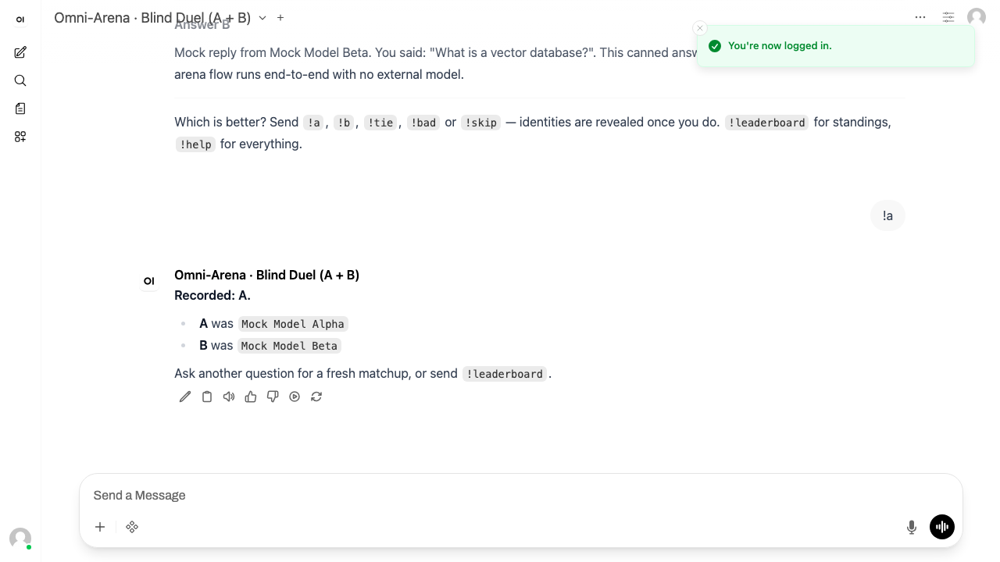
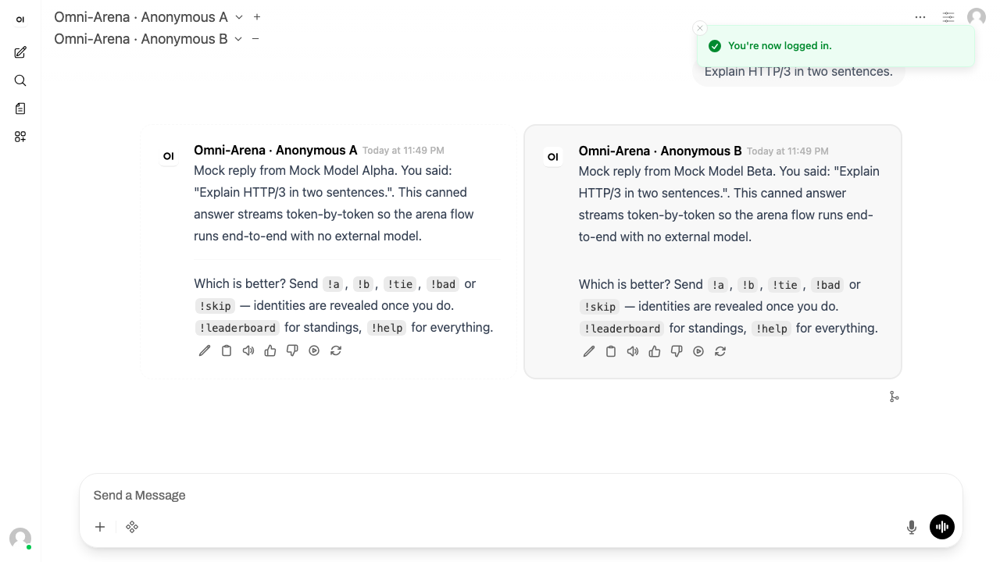
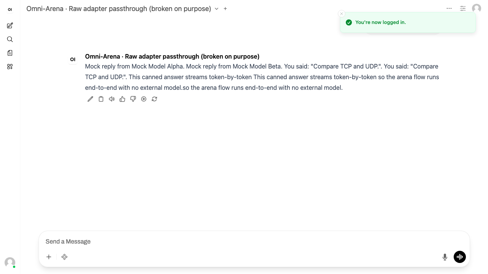
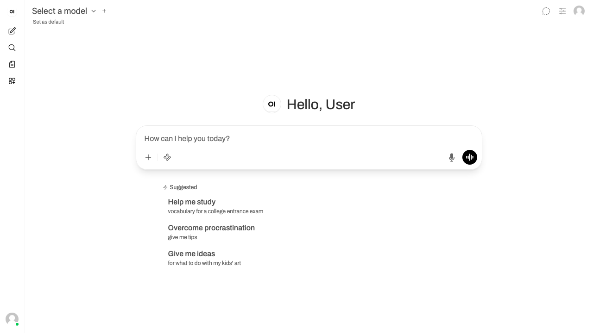

# Omni-Arena inside Open WebUI

A real, runnable integration of Omni-Arena into the actual upstream
[Open WebUI](https://github.com/open-webui/open-webui) (v0.10.2), driven through
the OpenAI-compatible SSE adapter. It boots with `docker compose`, runs key-free
against the deterministic mock provider, and has both an HTTP-level contract
suite and a Playwright suite that drives the real Open WebUI UI.

Everything lives in this directory. No file outside `integrations/open-webui/`
is modified.

## The short answer

**Blind side-by-side voting survives — but not through the adapter alone.**

Omni-Arena's `openai-sse` adapter could not be connected to Open WebUI at all,
for three independent reasons, each verified below: Omni-Arena served no OpenAI
API paths, it accepted no OpenAI request body, and its two-slot `choices[]`
encoding was misread by every OpenAI client including Open WebUI. So this
integration adds a small **bridge** (`bridge/`, ~450 lines) that speaks the
OpenAI API on one side and Omni-Arena's own API on the other.

All three have since been fixed in `server/` — and so has the rendezvous this
bridge had to invent, which shipped as **slot join** (see the note under
[Findings](#findings-about-omni-arena)). What keeps a bridge here is therefore no
longer *translation* but *interaction*: the blind pseudo-model roster Open WebUI
builds its picker from, the vote and the reveal as chat messages, the standings
rendered as markdown, the duel renderer that stacks two slots into one text
channel, and the canned reply that stops Open WebUI's non-streaming helper tasks
from becoming matchups. The parts that are now redundant are still in
`bridge/` — see [What the bridge no longer needs to
do](#what-the-bridge-no-longer-needs-to-do).

With the bridge in place, arena mode works better in Open WebUI than expected:

| Arena capability | Status in Open WebUI |
|---|---|
| Two answers, streamed, anonymous | ✅ works |
| **Genuine side-by-side columns** | ✅ works — via Open WebUI's own multi-model compare view |
| Blind (no identity before the vote) | ✅ works |
| Five-way vote (left/right/both good/both bad/skip) | ✅ works — as `!a` / `!b` / `!tie` / `!bad` / `!skip` chat messages |
| Reveal after voting | ✅ works |
| Leaderboard with Bradley-Terry ratings | ✅ works — `!leaderboard` |
| Single (non-votable) mode | ✅ works |
| Multi-turn continuation from the winner | ⚠️ the adapter now carries `conversationId` (finding 4, since fixed); the bridge does not yet use it |
| One-click vote buttons | ❌ no UI extension point; votes are typed messages |
| Live streaming of slot B in duel mode | ⚠️ buffered until slot A finishes |





---

## Architecture

```
   host :3200                  (compose network)              host :3021            host :5452
┌────────────────┐        ┌───────────────────────┐      ┌──────────────────┐   ┌────────────┐
│   Open WebUI   │  HTTP  │        bridge         │ HTTP │    Omni-Arena    │   │  Postgres  │
│   v0.10.2      ├───────▶│  GET  /v1/models      ├─────▶│ POST /api/arena/ │──▶│            │
│  (container)   │  SSE   │  POST /v1/chat/       │ SSE  │   chat?protocol= │   │            │
│                │◀───────┤        completions    │◀─────┤   openai         │   └────────────┘
└────────────────┘        │  (+ vote, leaderboard)│      │ POST /api/arena/vote │
                          └───────────────────────┘      │ GET  /api/arena/     │
                                                         │        leaderboard   │
                                                         └──────────────────────┘
```

Omni-Arena runs **from this repository's source** on the host (`scripts/arena.mjs`
spawns `server/src/server.ts` with `tsx`), so the integration exercises the real
server rather than a stale image. The bridge is a container with **no published
host port** — only Open WebUI needs to reach it, and this integration is limited
to three host ports.

## Requirements

- Docker (Compose v2) — Docker Desktop must be running.
- Node.js 20+ and the repo's root `npm install` already done (the arena runs via `npx tsx`).
- No API keys for the default path.

## Run it (mock provider, no credits spent)

Four commands, from this directory:

```bash
cd integrations/open-webui

npm install                      # Playwright, for the UI suite
docker compose up -d             # Postgres :5452, bridge (internal), Open WebUI :3200
npm run arena                    # Omni-Arena on :3021 — leave this running
```

`npm run arena` blocks; run it in its own terminal. It waits for Postgres,
applies the real migrations, seeds the repository's own mock roster
(`server/src/db/seed.mock.ts` → *Mock Model Alpha* and *Mock Model Beta*), and
starts Omni-Arena with `ARENA_MOCK_PROVIDER=1` and `ARENA_TRIGGER=manual`.

Open WebUI takes about 40 seconds on first boot (it downloads an embedding
model). Then open **<http://localhost:3200>** — login is disabled, so you land
straight in a chat.

Optional, for real Bradley-Terry ratings instead of raw win rate:

```bash
docker compose --profile ratings up -d worker    # the repo's Python rating worker
```

### What to click

**1. Blind duel (one message, both answers)**

The model selector already shows `Omni-Arena · Blind Duel (A + B)`. Ask
anything — you get *Answer A* and *Answer B*, both anonymous. Then type `!a`,
`!b`, `!tie`, `!bad` or `!skip` as your next message. Identities are revealed in
the reply.

**2. Side-by-side (Open WebUI's native compare view)**

Click the **+** next to the model name in the top bar and add a second model, so
that both `Omni-Arena · Anonymous A` and `Omni-Arena · Anonymous B` are selected.
(Shortcut: <http://localhost:3200/?models=omni-arena-a,omni-arena-b>.) Ask a
question: two columns stream side by side, one arena slot each, from a **single**
matchup. Vote with `!a` / `!b` — each column then reveals its own identity and
the winner is marked.

**3. See the adapter bug for yourself**

Select `Omni-Arena · Raw adapter passthrough (broken on purpose)` and ask
anything. This pipes Omni-Arena's `openai-sse` output through byte-for-byte. You
get **one** answer: Open WebUI reads `choices[0]`, which is always slot A, so
slot B arrives on `choices[1]` and is silently dropped — there is no duel and
nothing to vote on without the bridge. See
[Findings](#findings-about-omni-arena).

The screenshot below was taken before the adapter was fixed, and shows what that
same pseudo-model used to produce: both models' tokens interleaved into one
incoherent message.



**4. Other things to try**

- `!leaderboard` — standings, with Bradley-Terry ratings once the worker has run.
- `!help` — the command list.
- `Omni-Arena · Single Model (no vote)` — Omni-Arena's `single` plan.
- `/a` instead of `!a` — nothing happens; Open WebUI reserves `/`.

## Run it with real providers

The mock provider is the default so no credits are spent. To use real models:

1. **Provider credentials.** Omni-Arena reads them from the repo-root `.env`
   (loaded by `server/src/env.ts`), so from the repository root:

   ```bash
   cp .env.example .env      # if you have not already
   ```

   and set the key for the provider you want. From
   [`server/src/providers/configure.ts`](../../server/src/providers/configure.ts):

   | Variable | Registers provider |
   |---|---|
   | `GOOGLE_API_KEY` | `google` (what the default seed uses) |
   | `OPENAI_API_KEY` and/or `OPENAI_BASE_URL` | `openai` (OpenAI or any OpenAI-compatible endpoint) |
   | `OLLAMA_BASE_URL` | `ollama` (always registered; defaults to `http://localhost:11434`) |
   | `VLLM_BASE_URL`, `VLLM_API_KEY` | `vllm` |
   | `HOST_PROXY_URL`, `HOST_PROXY_TOKEN` | `host-proxy` (your key never reaches Omni-Arena) |

   Also set `MATCHUP_TOKEN_SECRET` to a long random string; this integration
   otherwise falls back to a development default.

2. **Model roster.** The real seed
   ([`server/src/db/seed.ts`](../../server/src/db/seed.ts)) enables three Gemini
   models. Edit that file if you want a different lineup or a non-Google
   provider; entries are `{ displayName, providerModelId }` plus the `provider`
   column in its `INSERT`.

3. **Start with the mock disabled.** `ARENA_MOCK=0` switches
   `scripts/arena.mjs` to the real seed and stops registering the mock provider:

   ```bash
   docker compose up -d
   ARENA_MOCK=0 npm run arena
   ```

Nothing else changes: Open WebUI, the bridge, the pseudo-models and the commands
are all identical. The comparison is blind either way: the mock provider opens
with `Mock answer, variant <tag>`, where the tag is a hash of the provider model
id rather than a name, so the two canned answers are distinguishable without
either naming itself.

To reset everything, including the recorded votes:

```bash
docker compose down -v
```

## Tests

Both suites run against a stack that is already up (`docker compose up -d` plus
`npm run arena`):

```bash
npm test           # both suites, with a preflight check
npm run test:http  # just the OpenAI-surface contract suite
npm run test:e2e   # just the Playwright UI suite
```

- **`test/openai-surface.test.mjs`** asserts the contract Open WebUI
  actually depends on: `GET /v1/models`, streaming `POST /v1/chat/completions`
  with well-formed `chat.completion.chunk` frames on `choices[0]` and a trailing
  `[DONE]`, then the arena semantics on top — two anonymous answers, the
  rendezvous that joins two parallel requests into one matchup, the vote, the
  reveal, single mode, the leaderboard, and the non-streaming task path. It runs
  inside the bridge container because the bridge has no host port.
- **`e2e/tests/arena.spec.js`** (6 tests) drives the real Open WebUI UI in
  headless Chromium: the duel, the side-by-side compare view, the vote and
  reveal, single mode, the leaderboard, the raw passthrough rendering slot A
  alone, and the `/`-prefix refusal.

`e2e/tests/direct-probe.spec.js` is excluded from the suite; it is the one-off
experiment behind [finding 1](#1-omni-arena-serves-no-openai-api-paths-so-open-webui-discovers-nothing),
run with `docker-compose.direct-probe.yml`.

---

## Findings about Omni-Arena

These are the reasons this directory contains a bridge instead of a
configuration file. All were reproduced against Omni-Arena as it was when this
integration was built, and each is written as it was observed.

> **Since then, findings 1 through 5 have been fixed in `server/`.** Omni-Arena
> now serves `GET /models` (and `/v1/models`) and returns a JSON 404 for
> unmatched API paths; it accepts a standard `POST /chat/completions` body at
> `/chat/completions` and `/v1/chat/completions`; every OpenAI frame carries both
> slots so `choices[0]` is always slot A; `omni_arena` carries `conversationId` /
> `turnIndex`; and a failed slot is marked with `omni_arena_error` plus an
> `[omni-arena:slot-error]` prefix. The pairing this integration had to invent for
> Open WebUI's compare view shipped too, as **slot join** (`server/src/arena/join.ts`).
> The bridge and `test/openai-surface.test.mjs` were updated to the corrected
> *stream* contract; the request and pairing halves have not been switched over,
> so the bridge still does that work itself.
>
> The bridge is therefore no longer required for Omni-Arena to be *reachable*
> from an OpenAI client — only for the vote/reveal interaction and the blind
> pseudo-model roster. See [What the bridge no longer needs to
> do](#what-the-bridge-no-longer-needs-to-do).

### What the bridge no longer needs to do

The fixes above, plus slot join, move most of the bridge's reason for existing
into `server/`. What is left is a smaller, different thing. Recorded here as a
follow-up, because the bridge code has **not** been rewritten against the new
server surface — the redundant work is still in this directory:

| Bridge behaviour | Server equivalent today | State of `bridge/` |
|---|---|---|
| Translating an OpenAI body into `{ prompt, sessionId }` at `/api/arena/chat?protocol=openai` (`bridge/lib/arena.mjs`) | `openAiRequestAdapter`, on `/v1/chat/completions` | still translating; could forward the client's body untouched |
| Pairing the two parallel requests a compare turn produces (`SlotRendezvous`, `bridge/lib/state.mjs`) | slot join: `joinKey` on the request, `server/src/arena/join.ts` | still pairing in-process; could send `omni_arena.joinKey = chat_id` and let the server pair |
| Demultiplexing `choices[0]`/`choices[1]` into one channel per slot (`bridge/lib/channel.mjs`) | a joined round already streams one slot per connection | still demultiplexing, because it still pairs locally |
| Serving `GET /v1/models` | `server/src/routes/models.ts` | still needed — the server returns the *named* roster, and a blind picker needs the pseudo-models |
| Vote/reveal as `!a` / `!b` chat messages, per-chat matchup state, duplicate-vote dedupe across the two columns | none; `POST /api/arena/vote` is the whole API | still needed, and genuinely bridge-shaped |
| `!leaderboard` / `!help` rendered as markdown | none | still needed |
| Duel mode: both answers stacked in one assistant message | none | still needed — one text channel cannot interleave two answers |
| A canned answer for non-streaming helper tasks | the server 400s `stream: false` | still needed, and now the *only* thing standing between Open WebUI's title/tag helpers and an error |

The honest summary: the bridge has stopped being a translator and become an
*interaction layer*, but the code has not caught up with that yet.

### 1. Omni-Arena serves no OpenAI API paths, so Open WebUI discovers nothing

Open WebUI's OpenAI connection calls `GET {base}/models`
(`backend/open_webui/routers/openai.py:661`) and posts to
`{base}/chat/completions` (`:1238`). Omni-Arena registers only
`/api/arena/chat`, `/api/arena/vote`, `/api/arena/leaderboard`,
`/api/arena/control` and `/health` (`server/src/app.ts`).

Worse than a 404: because `createApp` installs an SPA fallback that returns
`index.html` for any non-`/api`, non-`/health` GET, `GET /v1/models` answers
**HTTP 200 with HTML**. Pointing Open WebUI straight at Omni-Arena
(`docker-compose.direct-probe.yml`) produces an empty model picker and this line
in the log:

```
ERROR | open_webui.routers.openai:send_get_request:115 - Connection error: 200,
message='Attempt to decode JSON with unexpected mimetype: text/html; charset=utf-8',
url='http://host.docker.internal:3021/v1/models'
```



The claim in `docs/md/integration.md` that the OpenAI adapter "suits Open WebUI"
and is "the universal fallback that reaches non-React stacks cheaply" is not
true as written. It reaches them only if someone writes a bridge first.

**Suggested fix:** an opt-in OpenAI-compatible router in `server/` —
`GET /v1/models` returning the enabled roster (or arena pseudo-models) and
`POST /v1/chat/completions` accepting `{ model, messages, stream }` and mapping
the last user message onto the arena's `prompt`. That is perhaps 120 lines and
would turn a paragraph of documentation into a true statement.

> **Shipped, both halves.** `server/src/routes/models.ts` serves the enabled
> roster on `/models` and `/v1/models`, and `registerChatRoute` now also mounts
> the chat handler on `/chat/completions` and `/v1/chat/completions` — both
> prefixes, because an OpenAI client is configured with a base URL and appends
> the path itself, so it can never be pointed at `?protocol=openai`. The path
> implies the protocol on those routes. `createApp`'s SPA fallback also excludes
> `/v1`, `/models` and `/chat/completions`, so the HTML-at-200 failure below
> cannot recur. The roster it returns is the *real* one, with model names —
> keeping the picker blind is what the bridge's pseudo-models are for.

### 2. The adapter emits OpenAI *framing* but not an OpenAI *request*

`POST /api/arena/chat?protocol=openai` still requires Omni-Arena's own body
(`{ prompt, sessionId?, conversationId?, arena? }`, `server/src/routes/chat.ts`).
An OpenAI client sends `{ model, messages, stream }` and gets:

```
$ curl -s -X POST 'http://localhost:3021/api/arena/chat?protocol=openai' \
    -d '{"model":"omni-arena","messages":[{"role":"user","content":"hi"}],"stream":true}'
{"error":"Invalid request","details":{"prompt":["Invalid input: expected string, received undefined"]}}
```

So "OpenAI-compatible" today means the response is OpenAI-shaped, not that the
endpoint is. The adapter layer is an *egress* port only; there is no matching
ingress.

> **Fixed.** The adapter layer grew an ingress half
> (`server/src/adapters/request-adapter.ts`), and `openAiRequestAdapter` in
> `openai-sse.ts` parses a stock `{ model, messages, stream }` body: the last user
> message becomes the `prompt`, unknown members (`temperature`, `tools`) are
> accepted and ignored, OpenAI's `user` seeds the arena's anonymous `sessionId`,
> and an `omni_arena` request extension carries what OpenAI has no field for —
> `conversationId`, the `arena` opt-in, and `joinKey`. A body is only claimed when
> it is unmistakably the protocol's own envelope (`messages` present, `prompt`
> absent), so Omni-Arena's native body still works unchanged. One deliberate
> refusal: `stream: false` is answered with a 400 rather than a buffered
> completion, because a matchup is two live streams. That is why the bridge's
> canned reply to Open WebUI's non-streaming helper tasks is still load-bearing —
> pointed straight at the server, those tasks would error instead of being
> quietly absorbed.

### 3. The two-slot `choices[]` encoding is misread by real clients — silently

This is the most consequential one, and it is worse than "slot B is dropped".

The adapter (`server/src/adapters/openai-sse.ts`) maps slot A to `index: 0` and
slot B to `index: 1`, and emits **one choice per frame**:

```
data: {...,"choices":[{"index":0,"delta":{"content":"Mock answer, variant 7de8. "},...}]}
data: {...,"choices":[{"index":1,"delta":{"content":"Mock answer, variant 952e. "},...}]}
data: {...,"choices":[{"index":0,"delta":{"content":"You said: \"hi\". "},...}]}
```

Both of Open WebUI's parsers read `choices[0]` **by array position**, not by the
`index` field:

- `src/lib/apis/streaming/index.ts:87` — `parsedData.choices?.[0]?.delta?.content ?? ''`
- `backend/open_webui/utils/middleware.py:4188` — `delta = choices[0].get('delta', {})`

Since every content frame is a one-element array, `choices[0]` is whichever slot
sent that token. The result is not "one answer rendered and the other lost" — it
is **both answers concatenated token by token into one incoherent message**, with
HTTP 200, valid chunks and a clean `[DONE]`. Nothing anywhere reports an error.
The `omni-arena-raw` pseudo-model was how this was reproduced on demand; now that
the adapter pins slot A to `choices[0]`, the same pseudo-model renders one
coherent answer and drops slot B, which is what both suites assert.

This is not an Open WebUI quirk. Reading `choices[0]` positionally is what
essentially every OpenAI client does, because the OpenAI API only ever returns
multiple choices when `n > 1`, and then it returns them **in the same frame**,
not spread across frames. The adapter's encoding is outside what the ecosystem
implements.

**Suggested fix:** treat multi-choice output as unreachable and pick one of:
(a) put both slots in the *same* frame's `choices` array (still ignored by
positional readers, but at least conformant); (b) ship one slot per completion
and expose the arena as two models the client selects together — what the bridge
does here, and what actually renders correctly; or (c) merge both answers into
one `choices[0]` text stream. Whichever is chosen, `docs/md/integration.md`
should stop implying that "OpenAI-compatible clients ignore unrecognized
top-level response fields, so Open WebUI and friends keep working unchanged."
They do ignore `omni_arena` — but they do not keep working.

### 4. The `omni_arena` extension omits `conversationId`, so multi-turn is impossible

Every other adapter carries the conversation identity:

| Adapter | Carries `conversationId` / `turnIndex` |
|---|---|
| native SSE (`matchup_started`) | yes |
| AG-UI (`CUSTOM arena_matchup`) | yes |
| A2UI (`surface_init`) | yes |
| Vercel AI (`data-arena-meta`) | yes |
| **OpenAI SSE (`omni_arena`)** | **no** — only `matchupId`, `matchupToken`, `mode`, `votable` |

Omni-Arena's multi-turn feature ("continue the chat from the winning response")
therefore cannot be driven over this protocol at all: a client has no id to send
back. This integration starts a fresh matchup on every turn as a result, which
means Open WebUI's own chat history is decorative — the arena never sees it. Two
extra fields in `openai-sse.ts` would fix this, and the schema is already
validated so it is a one-line change plus a test.

### 5. `slot_error` is indistinguishable from content

The adapter surfaces a failed slot as `content` on that choice
(`openai-sse.ts:104`). A client cannot tell "this model errored" from "this model
said the words *Provider timeout*". Every other adapter has a distinct error
frame (`data-arena-error`, `CUSTOM slot_error`, `kind: "error"`). Since OpenAI
chunks have no error field this is a real constraint, but the bridge cannot mark
a column as failed, and the vote UI cannot be suppressed for a broken matchup.

### 6. Practical operational gaps

- **No session identity on the wire.** The bridge has to synthesise Omni-Arena's
  `sessionId` from Open WebUI's `X-OpenWebUI-Chat-Id` header, which only exists
  if the deployment sets `ENABLE_FORWARD_USER_INFO_HEADERS=true` (off by
  default). Without it, every browser tab collapses into one bucket and votes
  can be attributed to the wrong matchup. Documenting this requirement is part
  of any real "works with Open WebUI" claim.
- **Helper tasks would poison the leaderboard.** Open WebUI posts to the chat
  model for title, tag, follow-up, autocomplete and retrieval-query generation.
  Against an arena, each of those is a matchup nobody will ever vote on — pure
  noise in the comparison graph, and with real providers, pure cost. This
  compose file disables all five, and the bridge additionally short-circuits any
  non-streaming request. An upstream `/v1/chat/completions` would need the same
  guard.
- **CORS default is `http://localhost:5173`.** Irrelevant here (server-to-server)
  but a browser-side OpenAI client would be blocked out of the box.

### Is `single`/shadow mode the right fit for OpenAI-compatible clients?

**Partly — it is the right *default*, and the wrong *conclusion*.**

The argument for single mode here is strong. A pure OpenAI surface has exactly
one response channel, no vote widget, and no place to put a matchup token that
the client will act on. Open WebUI's own answer to this problem is instructive:
it ships an **"Arena Model"** feature (`ENABLE_EVALUATION_ARENA_MODELS`,
`backend/open_webui/utils/middleware.py:2175`) that picks **one** model at random
per turn, hides its identity, and collects the built-in 👍/👎 as feedback for a
leaderboard under *Admin → Evaluations* — complete with its own Elo computation
(`backend/open_webui/routers/evaluations.py`, `_calculate_elo`). The largest OSS
chat UI, given exactly this constraint, chose single-blind-plus-rating rather
than side by side. That is real evidence that `single`/shadow is the natural
shape for this class of client, and it is also a competitive fact worth knowing:
Open WebUI already has a first-party arena, so Omni-Arena's pitch there is not
"blind comparison" — they have that — but the rating engine: Bradley-Terry with
Rao-Kupper ties, Fisher-information intervals, style control and anomaly
screening, against a hand-rolled pairwise Elo.

But the conclusion "OpenAI-compatible clients only get single mode" is too
pessimistic, and this integration is the counter-example. Two things rescue the
full matchup:

1. **Multi-model compare is a two-request protocol.** Open WebUI v0.10 fans a
   multi-model turn out into one parallel task per model, with identical
   `messages` and a shared `chat_id` (`backend/open_webui/main.py`, *"Fan out:
   one task per model"*). Two arena slots advertised as two pseudo-models can
   therefore be rendezvoused into one matchup, and the host renders them side by
   side with anonymous headers. Whether LibreChat and Lobe Chat fan out the same
   way is unverified here, but any client with a compare view has to issue one
   request per model, so the same rendezvous should transfer.

   > **This one moved into the server.** `server/src/arena/join.ts` is slot join:
   > a request opts in with `joinKey`, the first arrival leads and runs the whole
   > matchup, the second mirrors slot B off the leader's single generation, and
   > there is one matchup row and one vote. The scope is the tuple
   > (`sessionId`, `conversationId`, `prompt`, `joinKey`) rather than the key
   > alone, so a guessed `chat_id` cannot attach to someone else's round; an
   > unpaired leader degrades to today's both-slots-on-one-connection shape when
   > the window closes. The docstring cites this integration as the measured case.
2. **A vote does not need a widget.** A typed `!a` is a complete vote, and the
   reveal comes back as the next assistant message. It is worse UX than a
   button, but it is a real vote against a real HMAC-signed matchup token, and
   it feeds the same rating engine.

So the useful product framing is a **ladder**, not a switch: `single` when the
client can only render one answer; a *duel-in-one-message* when it can render
one rich message; and a *paired-slot matchup* when it has a compare view. Only
the first is currently expressible in Omni-Arena's mode enum. If arena modes are
going to be a first-class concept, `ARENA_TRIGGER`/`mode` is the wrong axis on
its own — what the client can *render* is the axis that decides what the arena
should send, and that is orthogonal to when it should engage.

Two smaller notes on the mode work as it stands:

- `single` plans emit `matchupToken: ""` and `matchupId: <random uuid>` for a
  matchup that was never persisted. A client that does not check `votable` will
  send a vote for a nonexistent matchup and get a 404 rather than a clear error.
  Consider omitting the ids entirely when `votable` is false.

  > **Mostly fixed.** A `single` round now omits `matchupToken`,
  > `conversationId` and `turnIndex` entirely rather than shipping empty or
  > unusable ones, so `omni_arena` on a non-votable round carries only
  > `matchupId`, `mode` and `votable`. `matchupId` stays, because it is the
  > handle the WebSocket control plane stops the stream by — a stoppable round
  > needs an id even when there is nothing to vote on.
- `single` plans run `ArenaCore.stream` with `modelA === modelB` and
  `activeSlots: 1`. It works, but the assignment is a lie in the type — a
  `SingleAssignment` variant would be honest and would stop `slotB` from being
  meaningful-looking in logs.

  > **Fixed differently, and better.** `ArenaCore.stream` now takes
  > `{ A: Model; B?: Model }` and derives its slot count from whether `B` is
  > there, so a single round simply omits it. No duplicated model, no separate
  > count, and the docstring records why.

---

## What works and what does not

### Works

- Open WebUI discovers the arena as normal OpenAI models and connects with no patches.
- Blind duel: two anonymous answers in one message, streamed.
- **Side-by-side**: Open WebUI's own compare view, one arena slot per column,
  both live-streaming, from one matchup. Column headers are the pseudo-model
  names, so no identity leaks.
- All five votes, as `!a` / `!b` / `!tie` / `!bad` / `!skip`.
- Reveal after voting; in compare mode each column reveals its own slot and the
  winner is marked.
- One vote per matchup, enforced across the two parallel requests a compare turn
  produces.
- `single` mode, correctly non-votable.
- Leaderboard in chat, including Bradley-Terry ratings when the worker runs.
- The stack is key-free with `ARENA_MOCK_PROVIDER`, and switches to real
  providers with one environment variable.

### Does not work

- **Multi-turn arena continuation.** Every turn is still a fresh matchup and Open
  WebUI's chat history is never sent to the arena. This was blocked by the wire
  (finding 4, since fixed — `omni_arena` now carries `conversationId` /
  `turnIndex`); what remains is bridge work: keeping the last winner's
  conversation per Open WebUI chat and sending it back.
- **One-click voting.** Open WebUI has no extension point for custom controls in
  the message area over an OpenAI connection — no buttons, no side panel, no
  callback. Its built-in 👍/👎 write to its own `feedbacks` table and are never
  forwarded upstream, so they cannot reach Omni-Arena. Votes are typed messages.
- **`/`-prefixed commands.** Open WebUI reserves a leading `/` for its
  prompt-shortcut menu and will not send such a message at all — verified in the
  UI and asserted in the suite. Hence `!`.
- **Live streaming of slot B in duel mode.** One text channel cannot interleave
  two answers, so slot A streams live and slot B is buffered and flushed under
  its heading afterwards. Side-by-side mode has no such limitation.
- **One-click per-slot error UI.** The wire now marks a failed slot (finding 5,
  since fixed) and the bridge notes the dead column in its text, but Open WebUI
  has no place to render it as anything richer.
- **Editing/regenerating a message.** Regeneration issues a fresh request, so it
  starts a new matchup; the previous one is left unvoted. Harmless but untidy.
- **Blindness with the mock provider.** `MockModelProvider` writes its own
  display name into its output, so the demo is only blind in the UI-chrome
  sense. Real providers do not do this.
- **Concurrent chats without `ENABLE_FORWARD_USER_INFO_HEADERS`** (finding 6).

### Needs manual intervention

- Docker Desktop must be running before `docker compose up -d`.
- Open WebUI downloads a sentence-transformers embedding model on first boot
  (~40 s, needs network). Nothing in this integration uses it; it is Open WebUI's
  own RAG default.
- Real-provider use requires your own API key and spends credits. No paid
  service is needed for anything documented above except that.

## Pinned versions

| Component | Version | Where |
|---|---|---|
| Open WebUI image | `ghcr.io/open-webui/open-webui:v0.10.2` | `docker-compose.yml` |
| Open WebUI source (for verification only) | tag `v0.10.2`, commit `ecd48e2f718220a6400ecf49eafd4867a38feb10` | `upstream.json`, `npm run clone-upstream` |
| Postgres | `postgres:16-alpine` | `docker-compose.yml` |
| Bridge runtime | `node:22-alpine` | `docker-compose.yml` |
| Playwright | `@playwright/test` 1.61.1 | `package.json` |
| Omni-Arena | this working tree, run from source | `scripts/arena.mjs` |

`npm run clone-upstream` fetches the Open WebUI source at that exact commit into
a gitignored `.upstream/`. It is not needed to run the integration — only to
re-check the source citations in this document.

## Ports

Only three host ports are used, all of them the ones allocated to this
integration:

| Port | Service |
|---|---|
| 3021 | Omni-Arena API (host process) |
| 5452 | Postgres (container) |
| 3200 | Open WebUI (container) |

The bridge listens on 8080 **inside the compose network only** and is not
published.

## Layout

```
integrations/open-webui/
├── docker-compose.yml              Postgres + bridge + Open WebUI (+ optional worker)
├── docker-compose.direct-probe.yml one-off overlay for finding 1
├── upstream.json                   pinned Open WebUI tag/commit/image
├── bridge/
│   ├── server.mjs                  routing, the four render modes, vote handling
│   └── lib/
│       ├── arena.mjs               Omni-Arena client + openai-sse stream parser
│       ├── openai.mjs              single-choice chunk writer
│       ├── models.mjs              the pseudo-model roster
│       ├── state.mjs               per-chat matchup state + the slot rendezvous
│       └── channel.mjs             async queue used to demultiplex the two slots
├── scripts/
│   ├── arena.mjs                   boots Omni-Arena from repo source on :3021
│   ├── test.mjs                    preflight + both suites
│   └── clone-upstream.mjs          pinned Open WebUI checkout
├── test/openai-surface.test.mjs    HTTP contract suite (runs in the bridge container)
├── e2e/tests/arena.spec.js         Playwright suite against the real Open WebUI UI
└── docs/                           screenshots referenced above
```
