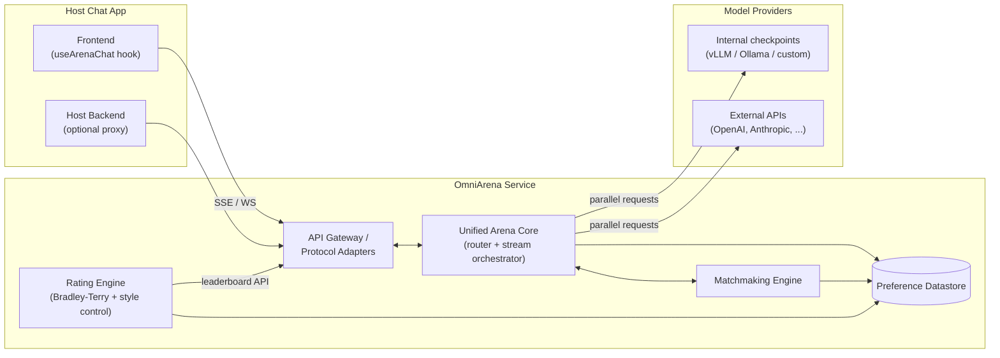

# OmniArena — High-Level Architecture

> Status: pre-design draft. This document describes the *very* high-level architecture for OmniArena — a standalone, framework-agnostic microservice that adds pairwise LLM evaluation ("Arena Mode") to any chat application. It intentionally avoids implementation detail; the resolved architecture decisions are recorded at the bottom.

## 1. System Context

OmniArena sits **between** a host chat application and the model providers. The host app never talks to models directly for arena traffic — it talks to OmniArena, which fans out to two models, multiplexes the streams back, collects the vote, and maintains the leaderboard.

## 2. Core Components

### 2.1 Unified Arena Core (Router + Stream Orchestrator)
The heart of the service. It is **protocol-agnostic**: it fires two parallel model requests, normalizes each provider's output into a single internal event stream (e.g. `{slot, type, payload}` events such as `token`, `tool_call`, `error`, `done`), and never contains transport-specific logic.

Responsibilities:
- Fan-out: parallel requests to models in slot A and slot B.
- Normalization: provider responses → internal typed events tagged with stream origin.
- Resiliency: if one model fails or times out, emit an `error` event for that slot only; the surviving stream continues uninterrupted.
- Control plane: accept mid-stream commands (stop generation, user steering) — likely over WebSocket.

### 2.2 Protocol Adapters (Egress Layer)
Thin, stateless translators from the internal event stream to whatever the host app speaks. Each adapter is a pluggable module around the same core:

| Adapter | Purpose |
|---|---|
| Multiplexed SSE | Native format: `data: {"slot": "A", "token": "..."}` — one connection, two streams |
| WebSocket | Bidirectional control plane (stop, steer) + streaming fallback |
| Vercel AI SDK | Model A via main text channel; Model B multiplexed via custom `data-*` parts (UI Message Stream protocol / `createUIMessageStream` + `writer.merge`) |
| OpenAI SSE | Classic chat-completions shape for OpenAI/Ollama-built apps (dual streams mapped in) |
| AG-UI | Typed agent events (`TEXT_MESSAGE_CONTENT`, `TOOL_CALL_START`, …) for agentic evaluation |
| A2UI | Schema-validated JSON streaming for generative-UI evaluation |

### 2.3 Matchmaking Engine
Decides *which* two models fight. Stateless logic over datastore state:
- **Blind randomization** ("King of the Hill"): random slot assignment, identities hidden until vote submission.
- **Smart sampling**: prioritize under-evaluated pairs and high-variance matchups for sample efficiency; out-of-flow models can be injected against an in-flow model mid-conversation.
- Issues a signed **matchup token** so votes can't be forged and identities can't be sniffed pre-vote.

### 2.4 Preference Datastore
Independent database owned entirely by OmniArena (decoupled from the host app):
- `models` — id, provider, capabilities, current rating.
- `matchups` — model_a, model_b, prompt reference, timestamp.
- `preferences` — vote, winner, position-bias metadata.
- Conversation/turn records to enforce the **linear history policy** (every follow-up turn descends only from the winning response).
- Chat logs are **PII-scrubbed before persistence**.

### 2.5 Rating Engine
An asynchronous/batch component — deliberately *off* the hot streaming path, and run as a **separate Python worker** (the streaming core is TypeScript; the rating side needs NumPy-class numeric tooling):
- **Bradley-Terry via MLE** for model strength (the modern replacement for online Elo, as used by LMArena).
- **Style control**: contextual BT regression with additive style coefficients (token-count difference, markdown density, latency) so rankings reflect substance, not presentation.
- **Bootstrapping** (multinomial, over unique-count distributions) for confidence intervals; vectorized + multiprocessed for fast leaderboard refresh.
- **Anomaly detection**: p-value testing to exclude spam/malicious voters before fitting.

### 2.6 Frontend SDK
Drop-in `useArenaChat` (React/Vue) hook that hides all multi-stream complexity: renders dual streams, manages voting UI states, submits votes with the matchup token — target integration is under ten lines of code.

## 3. Key Data Flows

**Battle flow (hot path):**
1. User prompt arrives via an adapter → Arena Core.
2. Matchmaking picks a pair, assigns random slots, issues a signed matchup token.
3. Core fans out two parallel model calls; tokens are normalized into internal events and multiplexed out through the caller's adapter in real time.
4. If one model errors/times out, its slot gets an error event; the other stream is unaffected.

**Vote flow:**
1. Client submits vote (left / right / tie / both-bad / skip) + matchup token.
2. Backend verifies the token (integrity, no premature identity leak), records the preference with position-bias metadata, and only then reveals model identities.
3. Follow-up turns branch exclusively from the winning response (linear history).

**Leaderboard flow (cold path):**
1. Rating engine periodically (or on-trigger) pulls fresh preferences.
2. Filters anomalous voters → fits style-controlled Bradley-Terry → bootstraps CIs.
3. Publishes ratings back to `models` and serves them via a leaderboard API.

## 4. Guiding Principles

- **Hexagonal core (ports & adapters, dependency injection)**: one internal event model; protocol adapters, model providers, and persistence are injected ports at the edges. Adding a new protocol or provider never touches core logic. This is also what enables dual key-custody modes — "OmniArena calls providers directly" and "host backend proxies model calls" are just two implementations of the same model-provider port.
- **Separation of hot and cold paths**: streaming/voting is latency-critical; rating computation is batch and must never block a stream.
- **Own your data**: independent datastore so evaluation survives host-app changes and can be analyzed offline.
- **Trust nothing from the client**: model identities and vote integrity are enforced server-side with signed tokens.

## 5. Decision Record (resolved 2026-07-06)

| # | Decision | Choice |
|---|---|---|
| 1 | Runtime | **Split**: TypeScript streaming core + Python rating worker (NumPy/`arena-rank`-class tooling for BT fitting) |
| 2 | Datastore | **PostgreSQL only** (JSONB for flexible metadata); revisit analytics store only if vote volume demands it |
| 3 | Topology | **Hexagonal architecture with ports & adapters + dependency injection** — protocol adapters, model providers, and persistence are all injected ports around a pure core |
| 4 | Rating cadence | **Periodic batch** BT refit (matches LMArena practice; BT is a batch MLE) |
| 5 | Tenancy | **Single-tenant, self-hosted** (Docker image per team); chat data never leaves adopter infra |
| 6 | Model key custody | **Both modes supported**: OmniArena holds provider keys and calls models directly (default, preserves blinding), *or* the host backend proxies model calls via a provider-port implementation |
| 7 | Transport | **SSE** for token streams + **WebSocket** control plane (stop/steer) |
| 8 | Prompt/response storage | **Full conversations, PII-scrubbed** before persistence (needed for style features and retroactive analysis) |
| 9 | Matchup integrity | **Stateless signed token (HMAC/JWT)**; single-use enforced by a uniqueness constraint on vote insert |
| 10 | Frontend SDK | **Headless hook only** (`useArenaChat`), no styled components |
| 11 | Adapter priority | Native multiplexed SSE first, then **AG-UI / A2UI** (agentic + generative-UI evaluation as the differentiator), then Vercel AI SDK and OpenAI SSE |
| 12 | Voter identity | **Anonymous** with fingerprint/session heuristics; anomaly detection compensates for Sybil risk |
