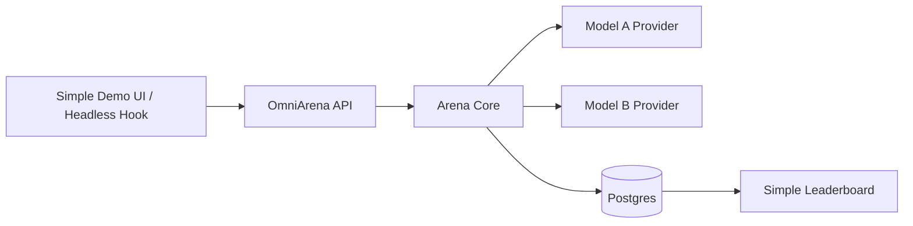

# OmniArena MVP / POC Plan

> Goal: build the smallest useful version of OmniArena that proves the core idea — blind, side-by-side model comparison with streamed responses and recorded votes — while keeping the code shaped so it can grow into the full architecture described in `architecture.md`.

## 1. MVP Principle

The MVP should **not** try to build the whole arena platform. It should prove one thin vertical slice:



Keep the same future boundaries, but implement only the simplest adapter behind each boundary.

## 2. What The MVP Must Do

1. Accept a user prompt.
2. Pick two models from a small configured list.
3. Randomly assign them to `slot_a` and `slot_b`.
4. Stream both responses back over one native multiplexed SSE endpoint.
5. Hide model identities until the user submits a vote.
6. Store the matchup, generated responses, and vote in Postgres.
7. Reveal model identities after a valid vote.
8. Show a simple leaderboard based on win counts / win rate.

If this works, OmniArena has proven its core product loop.

## 3. Explicit Non-Goals For MVP

Do **not** build these yet:

- Vercel AI SDK adapter.
- Additional model-provider integrations.
- AG-UI / A2UI adapter.
- WebSocket control plane.
- Python Bradley-Terry rating worker.
- Style-controlled regression.
- Multimodal inputs.
- Multi-turn linear history.
- Advanced smart matchmaking.
- PII scrubbing beyond a placeholder interface.
- Published npm package.
- Fully polished SDK or UI components.

These are important later, but they are not needed to validate the first end-to-end loop.

## 4. MVP Architecture

### 4.1 Single TypeScript Backend

Use one TypeScript backend service for the POC. Even though the full architecture uses a Python rating worker later, the MVP can keep ratings simple inside the backend.

Why:
- one runtime for the first build;
- easiest to implement SSE and provider streaming;
- keeps frontend/headless hook types close to backend event types;
- avoids over-investing in rating math before there is vote data.

Future path:
- extract rating into the Python worker once the data model and vote loop are stable.

### 4.2 Keep Hexagonal Boundaries

Even in the MVP, do not let everything become one tangled route handler. Use small ports/interfaces:

- `ModelProviderPort`: streams tokens from a model.
- `MatchmakingPort`: picks model pairs.
- `PreferenceRepositoryPort`: stores matchups, responses, and votes.
- `LeaderboardPort`: computes or reads model scores.
- `EventAdapter`: converts internal arena events to SSE.

The implementation can be simple, but the boundaries should already exist.

### 4.3 Native SSE Only

Start with one endpoint that streams internal arena events as SSE:

```text
event: token
data: {"slot":"A","token":"Hello"}

event: token
data: {"slot":"B","token":"Hi"}

event: done
data: {"slot":"A"}
```

This proves the hardest product behavior: two concurrent model outputs over one client connection.

All future adapters can translate the same internal event model into their own protocols.

## 5. Minimal Data Model

Use Postgres from the start so the MVP does not need a datastore migration later.

### `models`

```text
id
display_name
provider
provider_model_id
enabled
created_at
```

### `matchups`

```text
id
prompt
model_a_id
model_b_id
slot_a_model_id
slot_b_model_id
matchup_token_hash
created_at
```

For MVP, `model_a_id` / `model_b_id` can be the actual pair and `slot_*` stores randomized display assignment. Later this can be cleaned up if naming becomes confusing.

### `responses`

```text
id
matchup_id
slot
model_id
content
latency_ms
error
created_at
```

### `preferences`

```text
id
matchup_id
vote
winner_model_id
position_bias_meta
anonymous_session_id
created_at
```

Allowed MVP votes:

```text
left
right
both_good
both_bad
skip
```

## 6. Minimal API Surface

### `POST /api/arena/chat`

Starts a matchup and returns an SSE stream.

Request:

```json
{
  "prompt": "Explain JWTs in simple terms",
  "sessionId": "anon_123"
}
```

SSE events:

```text
matchup_started
token
slot_error
slot_done
matchup_done
```

Important: `matchup_started` returns only public slot IDs and a vote token. It does **not** return model names.

### `POST /api/arena/vote`

Records a vote and reveals model identities.

Request:

```json
{
  "matchupId": "match_123",
  "matchupToken": "signed-token",
  "vote": "left"
}
```

Response:

```json
{
  "accepted": true,
  "models": {
    "A": {"id": "model_1", "displayName": "Internal Fine Tune v3"},
    "B": {"id": "model_2", "displayName": "GPT-4.1"}
  }
}
```

### `GET /api/arena/leaderboard`

Returns a simple leaderboard.

MVP scoring:

```text
score = wins / non_skip_votes
```

Return enough data for a headless `useArenaLeaderboard` hook:

```json
{
  "models": [
    {
      "id": "model_1",
      "displayName": "Internal Fine Tune v3",
      "wins": 12,
      "losses": 8,
      "ties": 3,
      "winRate": 0.6
    }
  ]
}
```

## 7. Minimal Frontend

Build a tiny local demo page before publishing a real SDK.

It should have:
- one prompt box;
- two anonymous response panes labeled `A` and `B`;
- streaming text in both panes;
- vote buttons;
- identity reveal after vote;
- simple leaderboard view.

The first version of `useArenaChat` can live inside the app/repo, not as a package.

MVP hook shape:

```ts
type ArenaSlot = "A" | "B";

type ArenaVote = "left" | "right" | "both_good" | "both_bad" | "skip";

function useArenaChat() {
  return {
    sendPrompt,
    vote,
    slots,
    isStreaming,
    revealedModels,
    error,
  };
}
```

## 8. Model Provider Strategy

Start with one production provider implementation:

1. `GoogleModelProvider`
   - streams responses through the Gemini API;
   - uses `GOOGLE_API_KEY`;
   - supports a configured lineup of Google model IDs.

Tests use small in-memory provider implementations behind `ModelProviderPort`.
This keeps the production path Google-only without coupling the arena core to
the Gemini SDK.

## 9. MVP Matchmaking

Keep it intentionally naive:

1. Load all enabled models.
2. Randomly pick two distinct models.
3. Randomly assign them to slot A/B.
4. Create a signed matchup token.

Do not implement uncertainty sampling or King-of-the-Hill ranking yet. Random pair selection is enough for the POC, as long as slot assignment is blind and randomized.

## 10. MVP Security

Minimum viable integrity:

- signed matchup token using HMAC/JWT;
- token includes `matchup_id`, `slot_a_model_id`, `slot_b_model_id`, and expiry;
- store only token hash in DB;
- enforce one vote per matchup with a unique constraint;
- never send model identities in the stream before vote acceptance.

This is enough to prove the anti-cheat shape. Later versions can add Redis/session checks and stronger bot detection.

## 11. MVP Rating

Do not start with Bradley-Terry. Start with transparent counts:

- wins;
- losses;
- ties;
- skip count;
- win rate;
- total votes.

Why:
- easy to debug;
- no statistical complexity before there is meaningful data;
- leaderboard contract can stay stable while implementation changes later.

Future migration:
- replace the leaderboard implementation behind `LeaderboardPort` with the Python Bradley-Terry worker;
- keep the API response shape compatible by adding `rating`, `confidenceInterval`, and `styleControlledRating` fields later.

## 12. Refactor Path To Full Architecture

The MVP should be built so each future upgrade is a replacement behind a port, not a rewrite.

| MVP Piece | Later Replacement |
|---|---|
| Native SSE only | Add protocol adapters only when product demand requires them |
| Random matchmaking | Smart sampling / King-of-the-Hill engine |
| Win-rate leaderboard | Python Bradley-Terry + style-control worker |
| In-repo hook | Published React/Vue headless SDK |
| Google Gemini provider | Additional Google model capabilities |
| Single-turn chat | Multi-turn linear history |
| Basic HMAC token | Stronger integrity + anomaly detection |

## 13. Suggested Build Order

1. Define internal arena event types.
2. Implement `GoogleModelProvider`.
3. Implement SSE multiplexing with two test provider streams.
4. Add Postgres schema for models, matchups, responses, preferences.
5. Add random matchmaking and signed matchup tokens.
6. Add vote endpoint and identity reveal.
7. Add simple leaderboard endpoint.
8. Build tiny demo UI with anonymous side-by-side panes.
9. Add basic tests around stream multiplexing, vote validation, and identity masking.

## 14. MVP Success Criteria

The MVP is successful when:

- a developer can configure two models;
- a user can submit one prompt;
- both model responses stream side-by-side;
- model names remain hidden during streaming;
- a vote is recorded;
- model names are revealed only after the vote;
- the leaderboard changes after votes;
- one model failing does not kill the other stream.

That is enough to prove OmniArena's core loop.
